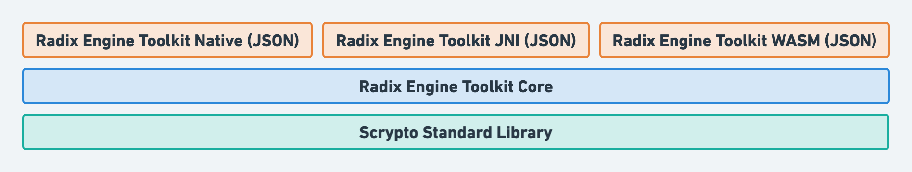

> [!NOTE]  
> More detailed documentation on the Radix Engine Toolkit is available on [our documentation site](https://docs.radixdlt.com/docs/radix-engine-toolkit) and examples are available in the [expiremental examples](https://github.com/radixdlt/experimental-examples/tree/main/radix-engine-toolkit) repository.

# Radix Engine Toolkit

The Radix Engine Toolkit is a multiplatform library written in Rust that exposes a set of functions to help clients written in languages other than Rust compile and decompile transactions, perform SBOR encoding and decoding, derive virtual account and virtual badge addresses, and other functionalities.

## Background

Babylon transactions are composed of a number of different parts, but their building blocks essentially boil down to: a transaction header, a manifest, and signatures which might either be intent signatures or a notary signature depending on what exactly was signed. The diagram below illustrates the relationship and names of the different parts of a transaction.

When we have a transaction intent, getting to a signed transaction intent requires that the transaction intent is "compiled" and signed. In this context, compiling something simply refers to encoding it in SBOR. Once all of the signers have signed the compiled transaction intent, then we have all we need to for a signed transaction intent.

Similarly, when the notary wishes to notarize a signed transaction intent, they compile the signed transaction intent (as explained above, they encode the signed transaction intent in SBOR), sign that, and with that they have the notary signature required to form a complete transaction.

## Motivation

As can be seen in the [background section](#background), the process of creating a transaction requires that a client is able to encode different parts of a transaction in SBOR to later allow for these parts to be signed or notarized. This means that a client would need to, at a minimum, have an SBOR encoder for compiling transactions, and perhaps a decoder if the decompilation of transactions is desirable.

The main implementation of SBOR is written in Rust. That being said, clients wishing to integrate their services with Radix (or just build and send programmatic transactions) could have clients written in a any programming languages. It is unrealistic to expect that clients would write, test, and maintain their own SBOR implementation in their client language as this is a high implementation burden on the client and is a non-trivial and potentially security critical task.

In addition to the building of transactions requiring SBOR for compilation, certain clients might wish to decompile transactions to figure out what the transaction does, who has signed it, contents of the header, or for other application-specific reasons. Much like compilation, without an SBOR implementation available to the client, the decompilation of transactions would be impossible.

Therefore, there is a strong need to **not** rewrite SBOR in different languages, instead, to reuse and re-utilize the original SBOR implementation for clients written in any language. This library achieves that by being fully written in rust; thus leveraging the ability to use the original SBOR implementation, and being compilable to different targets to allow it to run on different operating systems with different processor architectures. In addition to that, this library may be compiled to WASM which means that languages with easy access to a WASM runtime can utilize this library. As an example, the Radix Engine Toolkit may run in the web by utilizing web assembly.

The choice of making the radix engine toolkit a library and not an REST API comes with a number of advantages, the first of which is that certain clients may wish to build their transactions, SBOR encode and decode their data, or Bech32 encode or decode their addresses in a trustless fashion without having to rely on a REST API where a non-negligible chance of tampering exists. Having this library as a library allows such clients to do all they need in a trustless manner without worrying about trusting an external server.

In addition to that, using WASM instead of a docker-based solution to this problem means that the solution is very lightweight and also compatible with platforms where Docker is no an option (mostly smart phones.), thus making this library available to the largest amount of clients without any compromises.

With the above in mind, this library allows for the following functionality to be performed in a turstless fashion:

1. The compilation and decompilation of unsigned, signed, and notarized transaction intents.
2. The ability to convert manifests between their string and JSON representations.
3. The ability to Bech32 encode and decode addresses as needed.
4. The ability to encode and decode SBOR values as needed.
5. The ability to statically validate transactions to check for common errors and problems (currently a work in progress, although this functionality is implemented as part of certain requests in the library)

## High Level Architecture Overview

This section gives a high-level overview of the architecture of the Radix Engine Toolkit and is useful for developers hoping to extend the Radix Engine Toolkit to add additional interfaces and additional ways to talk to use the core functionality available in the library.

The core functionality of the library is implemented in the `radix-engine-toolkit-core` crate. This crate has the definition of the requests, their responses, how they are validated, and how they are handled and fulfilled. This crate utilizes the Scrypto standard library as well as other dependencies from the Scrypto repository to handle requests. If there is a need to extend the library to handle a new request type (e.g. a request to statically validate transactions) then it is implemented in this crate. 

Utilizing the core crate are a number of "interface" crates which expose the functionality of the Radix Engine Toolkit for different platforms and through different serialization techniques. Currently, all communication into and out of toolkit happens in JSON, although, if other serialization techniques are desirable (e.g. CBOR or Protocol Buffers), then an additional "interface" crates may be implemented which make use of these serialization techniques. 

In addition to that, if it is desirable to expose the functionality in different ways (e.g. as a REST API) then a simple server may be implemented as an "interface" for the toolkit which would expose the `radix-engine-toolkit-core` functionality through a REST API interface.

## License

The Radix Engine Toolkit and Radix Engine Toolkit wrappers binaries are licensed under the [Radix Generic EULA](https://www.radixdlt.com/terms/genericEULA).

The Radix Engine Toolkit and Radix Engine Toolkit wrappers code is released under the [Apache 2.0 license](./LICENSE).

      Copyright 2023 Radix Publishing Ltd

      Licensed under the Apache License, Version 2.0 (the "License"); you may not use this file except in compliance with the License.

      You may obtain a copy of the License at: http://www.apache.org/licenses/LICENSE-2.0

      Unless required by applicable law or agreed to in writing, software distributed under the License is distributed on an "AS IS" BASIS, WITHOUT WARRANTIES OR CONDITIONS OF ANY KIND, either express or implied.

      See the License for the specific language governing permissions and limitations under the License.
