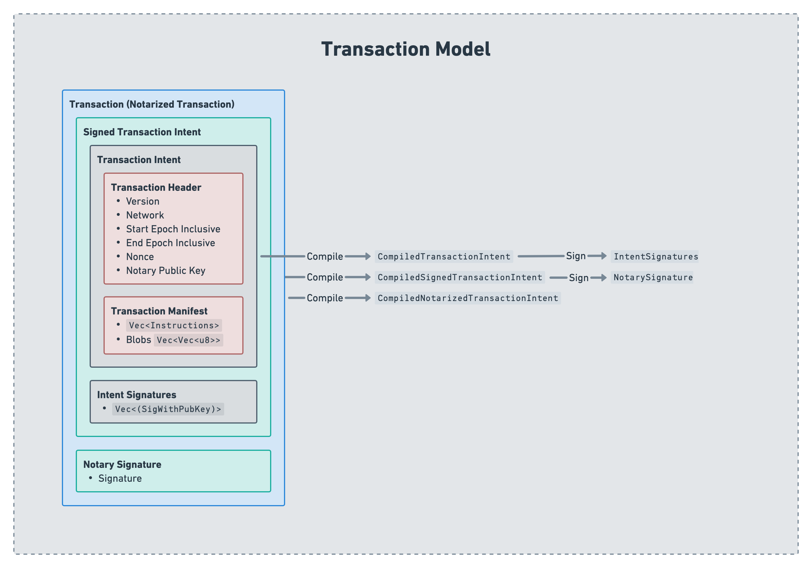

# Radix Engine Toolkit

This is a WebAssembly (WASM) library built using Rust to provide language-agnostic support for the following:

1. The compilation and decompilation of unsigned, signed, and notarized transaction intents.
1. The ability to convert manifests between their string and JSON representations.
1. The ability to Bech32 encode and decode addresses as needed. 
1. The ability to encode and decode SBOR values as needed. 

A client written in any language can leverage the abilities of this library as long as it has a WASM runtime library. [Here](https://github.com/wasmerio/wasmer#-language-integrations) is a list of all of the available wasmer runtimes, [here](https://github.com/bytecodealliance/wasmtime) is a list of the languages with a wasmtime runtime, and [here](https://github.com/appcypher/awesome-wasm-runtimes) is a list of the different WASM runtimes available and their supported language. Any WASM runtime should be suitable for this library.

## Background

Babylon transactions are composed of a number of different parts, but their building blocks essentially boil down to: a transaction header, a manifest, and signatures which might either be intent signatures or a notary signature depending on what exactly was signed. The diagram below illustrates the relationship and names of the different parts of a transaction. 



When we have a transaction intent, getting to a signed transaction intent requires that the transaction intent is "compiled" and signed. In this context, compiling something simply refers to encoding it in SBOR. Once all of the signers have signed the compiled transaction intent, we have all we need to for a signed transaction intent. 

Similarity, when the notary wishes to notarize a signed transaction intent, they compile the signed transaction intent (as explained above, they encode the signed transaction intent in SBOR), sign that, and with that they have the notary signature required to form a complete transaction. 

## Motivation

As can be seen in the [background section](#background), the process of creating a transaction requires that a client is able to encode different parts of a transaction in SBOR to later allow for these parts to be signed or notarized. This means that a client would need to, at a minimum, have an SBOR encoder for compiling transactions, and perhaps a decoder if the decompilation of transactions is desirable. 

The main implementation of SBOR is written in Rust. That being said, clients wishing to integrate their services with Radix (or just build and send programmatic transactions) could have clients written in a any programming languages. It is unrealistic to expect that clients would write, test, and maintain their own SBOR implementation in their client language as this is a high implementation burden on the client.

In addition to the building of transaction requiring SBOR for compilation, certain clients might wish to decompile transactions to figure out what the transaction intent is. Much like compilation, without an SBOR implementation available to the client, the decompilation of transactions would be impossible. 

Therefore, there is a strong need to **not** rewrite SBOR in different languages, instead, to reuse and reutilize the original SBOR implementation for clients written in any language. This library achieves that by being fully written in rust; thus leveraging the ability to use the original SBOR implementation, and being compilable to different targets with WASM and native iOS being the two main compilation targets for this library. WASM being a main compilation target means that any programming language with a WASM runtime can leverage and make use of this library. 

The choice of making the radix engine toolkit compilable to WASM comes with a number of advantages, the first of which is that certain clients may wish to build their transactions, SBOR encode and decode their data, or Bech32 encode or decode their addresses in a trustless fashion without having to rely on a REST API where a non-negligible chance of tampering exists. Having this library as a WASM module allows such clients to do all they need without worrying about trusting an external server.

In addition to that, using WASM instead of a docker-based solution to this problem means that the solution is very lightweight and also compatible with platforms where Docker is no an option (mostly smart phones.), thus making this library available to the largest amount of clients without any compromises. 

Therefore, this library provides the following features to any client language that has a WASM runtime:

1. The compilation and decompilation of unsigned, signed, and notarized transaction intents.
1. The ability to convert manifests between their string and JSON representations.
1. The ability to Bech32 encode and decode addresses as needed. 
1. The ability to encode and decode SBOR values as needed. 

## Features and Functions

This section lists all of the functions available in this library, what they are used for, what their arguments and returns are, and examples of their request and return. The types mentioned in this section are all provided in the [OpenAPI specification](./spec/transaction-api-spec.yaml) of this library, so, not much description will be given for these types here. 

### Information

| Function Name | `information` |
| ------------- | :----------------- |
| Functionality | The function provides information information on the currently in-use radix engine toolkit such as the version of the radix engine toolkit. In most cases, this is the first function written when integrating new clients; so, this function is often times seen as the "Hello World" example of the radix engine toolkit. |
| Request Type  | `InformationRequest` |
| Response Type | `InformationResponse` |

<details>
    <summary>Request Example</summary>
    
```json
{}
```
</details>

<details>
    <summary>Response Example</summary>
    
```json
{
  "package_version": "0.1.0"
}
```
</details>

### Convert Manifest

| Function Name | `convert_manifest` |
| ------------- | :----------------- |
| Functionality | Clients have a need to be able to read, parse, understand, and interrogate transaction manifests to get more information on what a transactions might be doing. Transaction manifests have so far existed in one format: as strings. While the string format is very human readable, it is not easily readable by machines as a lexer and parser are needed to make sense of them; thus, it is for clients to programmatically make sense of transactions. As such, there is a need for another transaction manifest format (to supplement, **NOT** replace) which machines can easily make sense of without the need to implement a lexer and parser.</br></br>Therefore, this library introduces a JSON format for transaction manifests which clients can use when wanting to read and interrogate their transaction manifests in code. The transaction manifest JSON format has a 1:1 mapping to the string format of transaction manifests, meaning that anything which can be done in the string format of transaction manifests, can be done in the JSON format as well.</br></br>This function allows the client the convert their manifest between the two supported manifest types: string and JSON. |
| Request Type  | `ConvertManifestRequest` |
| Response Type | `ConvertManifestResponse` |

<details>
    <summary>Request Example</summary>
    
```json
{
  "transaction_version": 1,
  "network_id": 242,
  "manifest_instructions_output_format": "JSON",
  "manifest": {
    "instructions": {
      "type": "String",
      "value": "# Withdraw XRD from account\n    CALL_METHOD ComponentAddress(\"account_sim1q02r73u7nv47h80e30pc3q6ylsj7mgvparm3pnsm780qgsy064\") \"withdraw_by_amount\" Decimal(\"5.0\") ResourceAddress(\"resource_sim1qqqqqqqqqqqqqqqqqqqqqqqqqqqqqqqqqqqqqqqqqqzqu57yag\");\n    \n    # Buy GUM with XRD\n    TAKE_FROM_WORKTOP_BY_AMOUNT Decimal(\"2.0\") ResourceAddress(\"resource_sim1qqqqqqqqqqqqqqqqqqqqqqqqqqqqqqqqqqqqqqqqqqzqu57yag\") Bucket(\"xrd\");\n    CALL_METHOD ComponentAddress(\"component_sim1q2f9vmyrmeladvz0ejfttcztqv3genlsgpu9vue83mcs835hum\") \"buy_gumball\" Bucket(\"xrd\");\n    ASSERT_WORKTOP_CONTAINS_BY_AMOUNT Decimal(\"3.0\") ResourceAddress(\"resource_sim1qqqqqqqqqqqqqqqqqqqqqqqqqqqqqqqqqqqqqqqqqqzqu57yag\");\n    ASSERT_WORKTOP_CONTAINS ResourceAddress(\"resource_sim1qzhdk7tq68u8msj38r6v6yqa5myc64ejx3ud20zlh9gseqtux6\");\n    \n    # Create a proof from bucket, clone it and drop both\n    TAKE_FROM_WORKTOP ResourceAddress(\"resource_sim1qqqqqqqqqqqqqqqqqqqqqqqqqqqqqqqqqqqqqqqqqqzqu57yag\") Bucket(\"some_xrd\");\n    CREATE_PROOF_FROM_BUCKET Bucket(\"some_xrd\") Proof(\"proof1\");\n    CLONE_PROOF Proof(\"proof1\") Proof(\"proof2\");\n    DROP_PROOF Proof(\"proof1\");\n    DROP_PROOF Proof(\"proof2\");\n    \n    # Create a proof from account and drop it\n    CALL_METHOD ComponentAddress(\"account_sim1q02r73u7nv47h80e30pc3q6ylsj7mgvparm3pnsm780qgsy064\") \"create_proof_by_amount\" Decimal(\"5.0\") ResourceAddress(\"resource_sim1qqqqqqqqqqqqqqqqqqqqqqqqqqqqqqqqqqqqqqqqqqzqu57yag\");\n    POP_FROM_AUTH_ZONE Proof(\"proof3\");\n    DROP_PROOF Proof(\"proof3\");\n    \n    # Return a bucket to worktop\n    RETURN_TO_WORKTOP Bucket(\"some_xrd\");\n    TAKE_FROM_WORKTOP_BY_IDS Set<NonFungibleId>(NonFungibleId(\"0905000000\"), NonFungibleId(\"0907000000\")) ResourceAddress(\"resource_sim1qqqqqqqqqqqqqqqqqqqqqqqqqqqqqqqqqqqqqqqqqqzqu57yag\") Bucket(\"nfts\");\n    \n    # Create a new fungible resource\n    CREATE_RESOURCE Enum(\"Fungible\", 0u8) Map<String, String>() Map<Enum, Tuple>() Some(Enum(\"Fungible\", Decimal(\"1.0\")));\n    \n    # Cancel all buckets and move resources to account\n    CALL_METHOD ComponentAddress(\"account_sim1q02r73u7nv47h80e30pc3q6ylsj7mgvparm3pnsm780qgsy064\") \"deposit_batch\" Expression(\"ENTIRE_WORKTOP\");\n    \n    # Drop all proofs\n    DROP_ALL_PROOFS;\n    \n    # Complicated method that takes all of the number types\n    CALL_METHOD ComponentAddress(\"component_sim1q2f9vmyrmeladvz0ejfttcztqv3genlsgpu9vue83mcs835hum\") \"complicated_method\" Decimal(\"1\") PreciseDecimal(\"2\");\n    \n    # Publish package\n    PUBLISH_PACKAGE Blob(\"36dae540b7889956f1f1d8d46ba23e5e44bf5723aef2a8e6b698686c02583618\") Blob(\"15e8699a6d63a96f66f6feeb609549be2688b96b02119f260ae6dfd012d16a5d\");\n    "
    },
    "blobs": [
      "10020000003007c00000000061736d010000000405017001010105030100100619037f01418080c0000b7f00418080c0000b7f00418080c0000b072503066d656d6f727902000a5f5f646174615f656e6403010b5f5f686561705f6261736503020019046e616d65071201000f5f5f737461636b5f706f696e746572004d0970726f64756365727302086c616e6775616765010452757374000c70726f6365737365642d6279010572757374631d312e35392e30202839643162323130366520323032322d30322d323329320c1000000000",
      "320c1000000000"
    ]
  }
}
```
</details>

<details>
    <summary>Response Example</summary>
    
```json
{
  "instructions": {
    "type": "JSON",
    "value": [
      {
        "instruction": "CALL_METHOD",
        "component_address": {
          "type": "ComponentAddress",
          "address": "account_sim1q02r73u7nv47h80e30pc3q6ylsj7mgvparm3pnsm780qgsy064"
        },
        "method_name": {
          "type": "String",
          "value": "withdraw_by_amount"
        },
        "arguments": [
          {
            "type": "Decimal",
            "value": "5"
          },
          {
            "type": "ResourceAddress",
            "address": "resource_sim1qqqqqqqqqqqqqqqqqqqqqqqqqqqqqqqqqqqqqqqqqqzqu57yag"
          }
        ]
      },
      {
        "instruction": "TAKE_FROM_WORKTOP_BY_AMOUNT",
        "amount": {
          "type": "Decimal",
          "value": "2"
        },
        "resource_address": {
          "type": "ResourceAddress",
          "address": "resource_sim1qqqqqqqqqqqqqqqqqqqqqqqqqqqqqqqqqqqqqqqqqqzqu57yag"
        },
        "into_bucket": {
          "type": "Bucket",
          "identifier": "xrd"
        }
      },
      {
        "instruction": "CALL_METHOD",
        "component_address": {
          "type": "ComponentAddress",
          "address": "component_sim1q2f9vmyrmeladvz0ejfttcztqv3genlsgpu9vue83mcs835hum"
        },
        "method_name": {
          "type": "String",
          "value": "buy_gumball"
        },
        "arguments": [
          {
            "type": "Bucket",
            "identifier": "xrd"
          }
        ]
      },
      {
        "instruction": "ASSERT_WORKTOP_CONTAINS_BY_AMOUNT",
        "amount": {
          "type": "Decimal",
          "value": "3"
        },
        "resource_address": {
          "type": "ResourceAddress",
          "address": "resource_sim1qqqqqqqqqqqqqqqqqqqqqqqqqqqqqqqqqqqqqqqqqqzqu57yag"
        }
      },
      {
        "instruction": "ASSERT_WORKTOP_CONTAINS",
        "resource_address": {
          "type": "ResourceAddress",
          "address": "resource_sim1qzhdk7tq68u8msj38r6v6yqa5myc64ejx3ud20zlh9gseqtux6"
        }
      },
      {
        "instruction": "TAKE_FROM_WORKTOP",
        "resource_address": {
          "type": "ResourceAddress",
          "address": "resource_sim1qqqqqqqqqqqqqqqqqqqqqqqqqqqqqqqqqqqqqqqqqqzqu57yag"
        },
        "into_bucket": {
          "type": "Bucket",
          "identifier": "some_xrd"
        }
      },
      {
        "instruction": "CREATE_PROOF_FROM_BUCKET",
        "bucket": {
          "type": "Bucket",
          "identifier": "some_xrd"
        },
        "into_proof": {
          "type": "Proof",
          "identifier": "proof1"
        }
      },
      {
        "instruction": "CLONE_PROOF",
        "proof": {
          "type": "Proof",
          "identifier": "proof1"
        },
        "into_proof": {
          "type": "Proof",
          "identifier": "proof2"
        }
      },
      {
        "instruction": "DROP_PROOF",
        "proof": {
          "type": "Proof",
          "identifier": "proof1"
        }
      },
      {
        "instruction": "DROP_PROOF",
        "proof": {
          "type": "Proof",
          "identifier": "proof2"
        }
      },
      {
        "instruction": "CALL_METHOD",
        "component_address": {
          "type": "ComponentAddress",
          "address": "account_sim1q02r73u7nv47h80e30pc3q6ylsj7mgvparm3pnsm780qgsy064"
        },
        "method_name": {
          "type": "String",
          "value": "create_proof_by_amount"
        },
        "arguments": [
          {
            "type": "Decimal",
            "value": "5"
          },
          {
            "type": "ResourceAddress",
            "address": "resource_sim1qqqqqqqqqqqqqqqqqqqqqqqqqqqqqqqqqqqqqqqqqqzqu57yag"
          }
        ]
      },
      {
        "instruction": "POP_FROM_AUTH_ZONE",
        "into_proof": {
          "type": "Proof",
          "identifier": "proof3"
        }
      },
      {
        "instruction": "DROP_PROOF",
        "proof": {
          "type": "Proof",
          "identifier": "proof3"
        }
      },
      {
        "instruction": "RETURN_TO_WORKTOP",
        "bucket": {
          "type": "Bucket",
          "identifier": "some_xrd"
        }
      },
      {
        "instruction": "TAKE_FROM_WORKTOP_BY_IDS",
        "ids": [
          {
            "type": "NonFungibleId",
            "value": "0907000000"
          },
          {
            "type": "NonFungibleId",
            "value": "0905000000"
          }
        ],
        "resource_address": {
          "type": "ResourceAddress",
          "address": "resource_sim1qqqqqqqqqqqqqqqqqqqqqqqqqqqqqqqqqqqqqqqqqqzqu57yag"
        },
        "into_bucket": {
          "type": "Bucket",
          "identifier": "nfts"
        }
      },
      {
        "instruction": "CREATE_RESOURCE",
        "args": [
          {
            "type": "Enum",
            "variant": "Fungible",
            "fields": [
              {
                "type": "U8",
                "value": "0"
              }
            ]
          },
          {
            "type": "Map",
            "key_type": "String",
            "value_type": "String",
            "elements": []
          },
          {
            "type": "Map",
            "key_type": "Enum",
            "value_type": "Tuple",
            "elements": []
          },
          {
            "type": "Option",
            "variant": "Some",
            "field": {
              "type": "Enum",
              "variant": "Fungible",
              "fields": [
                {
                  "type": "Decimal",
                  "value": "1"
                }
              ]
            }
          }
        ]
      },
      {
        "instruction": "CALL_METHOD",
        "component_address": {
          "type": "ComponentAddress",
          "address": "account_sim1q02r73u7nv47h80e30pc3q6ylsj7mgvparm3pnsm780qgsy064"
        },
        "method_name": {
          "type": "String",
          "value": "deposit_batch"
        },
        "arguments": [
          {
            "type": "Expression",
            "value": "ENTIRE_WORKTOP"
          }
        ]
      },
      {
        "instruction": "DROP_ALL_PROOFS"
      },
      {
        "instruction": "CALL_METHOD",
        "component_address": {
          "type": "ComponentAddress",
          "address": "component_sim1q2f9vmyrmeladvz0ejfttcztqv3genlsgpu9vue83mcs835hum"
        },
        "method_name": {
          "type": "String",
          "value": "complicated_method"
        },
        "arguments": [
          {
            "type": "Decimal",
            "value": "1"
          },
          {
            "type": "PreciseDecimal",
            "value": "2"
          }
        ]
      },
      {
        "instruction": "PUBLISH_PACKAGE",
        "code": {
          "type": "Blob",
          "hash": "36dae540b7889956f1f1d8d46ba23e5e44bf5723aef2a8e6b698686c02583618"
        },
        "abi": {
          "type": "Blob",
          "hash": "15e8699a6d63a96f66f6feeb609549be2688b96b02119f260ae6dfd012d16a5d"
        }
      }
    ]
  },
  "blobs": [
    "10020000003007c00000000061736d010000000405017001010105030100100619037f01418080c0000b7f00418080c0000b7f00418080c0000b072503066d656d6f727902000a5f5f646174615f656e6403010b5f5f686561705f6261736503020019046e616d65071201000f5f5f737461636b5f706f696e746572004d0970726f64756365727302086c616e6775616765010452757374000c70726f6365737365642d6279010572757374631d312e35392e30202839643162323130366520323032322d30322d323329320c1000000000",
    "320c1000000000"
  ]
}
```
</details>

### Compile Transaction Intent

| Function Name | `compile_transaction_intent` |
| ------------- | :----------------- |
| Functionality | Takes a transaction intent and compiles it by SBOR encoding it and returning it back to the caller. This is mainly useful when creating a transaction. |
| Request Type  | `CompileTransactionIntentRequest` |
| Response Type | `CompileTransactionIntentResponse` |

<details>
    <summary>Request Example</summary>
    
```json
{
  "header": {
    "version": 1,
    "network_id": 242,
    "start_epoch_inclusive": 0,
    "end_epoch_exclusive": 100,
    "nonce": 1,
    "notary_public_key": {
      "type": "EddsaEd25519",
      "public_key": "3b6a27bcceb6a42d62a3a8d02a6f0d73653215771de243a63ac048a18b59da29"
    },
    "notary_as_signatory": true,
    "cost_unit_limit": 100000000,
    "tip_percentage": 5
  },
  "manifest": {
    "instructions": {
      "type": "String",
      "value": "# Withdraw XRD from account\n    CALL_METHOD ComponentAddress(\"account_sim1q02r73u7nv47h80e30pc3q6ylsj7mgvparm3pnsm780qgsy064\") \"withdraw_by_amount\" Decimal(\"5.0\") ResourceAddress(\"resource_sim1qqqqqqqqqqqqqqqqqqqqqqqqqqqqqqqqqqqqqqqqqqzqu57yag\");\n    \n    # Buy GUM with XRD\n    TAKE_FROM_WORKTOP_BY_AMOUNT Decimal(\"2.0\") ResourceAddress(\"resource_sim1qqqqqqqqqqqqqqqqqqqqqqqqqqqqqqqqqqqqqqqqqqzqu57yag\") Bucket(\"xrd\");\n    CALL_METHOD ComponentAddress(\"component_sim1q2f9vmyrmeladvz0ejfttcztqv3genlsgpu9vue83mcs835hum\") \"buy_gumball\" Bucket(\"xrd\");\n    ASSERT_WORKTOP_CONTAINS_BY_AMOUNT Decimal(\"3.0\") ResourceAddress(\"resource_sim1qqqqqqqqqqqqqqqqqqqqqqqqqqqqqqqqqqqqqqqqqqzqu57yag\");\n    ASSERT_WORKTOP_CONTAINS ResourceAddress(\"resource_sim1qzhdk7tq68u8msj38r6v6yqa5myc64ejx3ud20zlh9gseqtux6\");\n    \n    # Create a proof from bucket, clone it and drop both\n    TAKE_FROM_WORKTOP ResourceAddress(\"resource_sim1qqqqqqqqqqqqqqqqqqqqqqqqqqqqqqqqqqqqqqqqqqzqu57yag\") Bucket(\"some_xrd\");\n    CREATE_PROOF_FROM_BUCKET Bucket(\"some_xrd\") Proof(\"proof1\");\n    CLONE_PROOF Proof(\"proof1\") Proof(\"proof2\");\n    DROP_PROOF Proof(\"proof1\");\n    DROP_PROOF Proof(\"proof2\");\n    \n    # Create a proof from account and drop it\n    CALL_METHOD ComponentAddress(\"account_sim1q02r73u7nv47h80e30pc3q6ylsj7mgvparm3pnsm780qgsy064\") \"create_proof_by_amount\" Decimal(\"5.0\") ResourceAddress(\"resource_sim1qqqqqqqqqqqqqqqqqqqqqqqqqqqqqqqqqqqqqqqqqqzqu57yag\");\n    POP_FROM_AUTH_ZONE Proof(\"proof3\");\n    DROP_PROOF Proof(\"proof3\");\n    \n    # Return a bucket to worktop\n    RETURN_TO_WORKTOP Bucket(\"some_xrd\");\n    TAKE_FROM_WORKTOP_BY_IDS Set<NonFungibleId>(NonFungibleId(\"0905000000\"), NonFungibleId(\"0907000000\")) ResourceAddress(\"resource_sim1qqqqqqqqqqqqqqqqqqqqqqqqqqqqqqqqqqqqqqqqqqzqu57yag\") Bucket(\"nfts\");\n    \n    # Create a new fungible resource\n    CREATE_RESOURCE Enum(\"Fungible\", 0u8) Map<String, String>() Map<Enum, Tuple>() Some(Enum(\"Fungible\", Decimal(\"1.0\")));\n    \n    # Cancel all buckets and move resources to account\n    CALL_METHOD ComponentAddress(\"account_sim1q02r73u7nv47h80e30pc3q6ylsj7mgvparm3pnsm780qgsy064\") \"deposit_batch\" Expression(\"ENTIRE_WORKTOP\");\n    \n    # Drop all proofs\n    DROP_ALL_PROOFS;\n    \n    # Complicated method that takes all of the number types\n    CALL_METHOD ComponentAddress(\"component_sim1q2f9vmyrmeladvz0ejfttcztqv3genlsgpu9vue83mcs835hum\") \"complicated_method\" Decimal(\"1\") PreciseDecimal(\"2\");\n    \n    # Publish package\n    PUBLISH_PACKAGE Blob(\"36dae540b7889956f1f1d8d46ba23e5e44bf5723aef2a8e6b698686c02583618\") Blob(\"15e8699a6d63a96f66f6feeb609549be2688b96b02119f260ae6dfd012d16a5d\");\n    "
    },
    "blobs": [
      "10020000003007c00000000061736d010000000405017001010105030100100619037f01418080c0000b7f00418080c0000b7f00418080c0000b072503066d656d6f727902000a5f5f646174615f656e6403010b5f5f686561705f6261736503020019046e616d65071201000f5f5f737461636b5f706f696e746572004d0970726f64756365727302086c616e6775616765010452757374000c70726f6365737365642d6279010572757374631d312e35392e30202839643162323130366520323032322d30322d323329320c1000000000",
      "320c1000000000"
    ]
  }
}
```
</details>

<details>
    <summary>Response Example</summary>
    
```json
{
  "compiled_intent": "10020000001009000000070107f20a00000000000000000a64000000000000000a0100000000000000110c0000004564647361456432353531390100000093200000003b6a27bcceb6a42d62a3a8d02a6f0d73653215771de243a63ac048a18b59da2901010940420f00090500000010020000003011140000000a00000043616c6c4d6574686f640200000011070000005363727970746f02000000811b00000003d43f479e9b2beb9df98bc3888344fc25eda181e8f710ce1bf1de0c1200000077697468647261775f62795f616d6f756e7430074a0000001002000000a1200000000000f44482916345000000000000000000000000000000000000000000000000b61b0000000000000000000000000000000000000000000000000000000000041700000054616b6546726f6d576f726b746f704279416d6f756e7402000000a1200000000000c84e676dc11b000000000000000000000000000000000000000000000000b61b0000000000000000000000000000000000000000000000000000000000040a00000043616c6c4d6574686f640200000011070000005363727970746f02000000811b0000000292566c83de7fd6b04fcc92b5e04b03228ccff040785673278ef10c0b0000006275795f67756d62616c6c30070e0000001001000000b104000000000200001d000000417373657274576f726b746f70436f6e7461696e734279416d6f756e7402000000a12000000000002cf61a24a229000000000000000000000000000000000000000000000000b61b00000000000000000000000000000000000000000000000000000000000415000000417373657274576f726b746f70436f6e7461696e7301000000b61b00000000aedb7960d1f87dc25138f4cd101da6c98d57323478d53c5fb9510f00000054616b6546726f6d576f726b746f7001000000b61b0000000000000000000000000000000000000000000000000000000000041500000043726561746550726f6f6646726f6d4275636b65740100000009010200000a000000436c6f6e6550726f6f660100000009020200000900000044726f7050726f6f660100000009020200000900000044726f7050726f6f660100000009030200000a00000043616c6c4d6574686f640200000011070000005363727970746f02000000811b00000003d43f479e9b2beb9df98bc3888344fc25eda181e8f710ce1bf1de0c160000006372656174655f70726f6f665f62795f616d6f756e7430074a0000001002000000a1200000000000f44482916345000000000000000000000000000000000000000000000000b61b0000000000000000000000000000000000000000000000000000000000040f000000506f7046726f6d417574685a6f6e65000000000900000044726f7050726f6f660100000009040200000f00000052657475726e546f576f726b746f700100000009010200001400000054616b6546726f6d576f726b746f7042794964730200000031b402000000050000000905000000050000000907000000b61b0000000000000000000000000000000000000000000000000000000000040c00000043616c6c46756e6374696f6e0200000011060000004e617469766501000000110f0000005265736f757263654d616e616765720100000011060000004372656174650000000030075e0000001004000000110800000046756e6769626c65010000000700320c0c00000000321121000000001200110800000046756e6769626c6501000000a120000000000064a7b3b6e00d0000000000000000000000000000000000000000000000000a00000043616c6c4d6574686f640200000011070000005363727970746f02000000811b00000003d43f479e9b2beb9df98bc3888344fc25eda181e8f710ce1bf1de0c0d0000006465706f7369745f62617463683007180000001001000000c10e000000454e544952455f574f524b544f500d00000044726f70416c6c50726f6f6673000000000a00000043616c6c4d6574686f640200000011070000005363727970746f02000000811b0000000292566c83de7fd6b04fcc92b5e04b03228ccff040785673278ef10c12000000636f6d706c6963617465645f6d6574686f6430076f0000001002000000a120000000000064a7b3b6e00d000000000000000000000000000000000000000000000000a2400000000000000000000000023ed47ec9da71dcda2f4fb5e9f37fd2079e30000000000000000000000000000000000000000000000000000000000000000000000000000e0000005075626c6973685061636b61676502000000c22000000036dae540b7889956f1f1d8d46ba23e5e44bf5723aef2a8e6b698686c02583618c22000000015e8699a6d63a96f66f6feeb609549be2688b96b02119f260ae6dfd012d16a5d30300200000007d200000010020000003007c00000000061736d010000000405017001010105030100100619037f01418080c0000b7f00418080c0000b7f00418080c0000b072503066d656d6f727902000a5f5f646174615f656e6403010b5f5f686561705f6261736503020019046e616d65071201000f5f5f737461636b5f706f696e746572004d0970726f64756365727302086c616e6775616765010452757374000c70726f6365737365642d6279010572757374631d312e35392e30202839643162323130366520323032322d30322d323329320c10000000000707000000320c1000000000"
}
```
</details>

### Decompile Transaction Intent

| Function Name | `decompile_transaction_intent` |
| ------------- | :----------------- |
| Functionality | This function does the opposite of the [`compile_transaction_intent`](#compile-transaction-intent) function. It takes in a compiled transaction intent and decompiles it into its human-readable / machine-readable format. |
| Request Type  | `DecompileTransactionIntentRequest` |
| Response Type | `DecompileTransactionIntentResponse` |

<details>
    <summary>Request Example</summary>
    
```json
{
  "manifest_instructions_output_format": "String",
  "compiled_intent": "10020000001009000000070107f20a00000000000000000a64000000000000000a0100000000000000110c0000004564647361456432353531390100000093200000003b6a27bcceb6a42d62a3a8d02a6f0d73653215771de243a63ac048a18b59da2901010940420f00090500000010020000003011140000000a00000043616c6c4d6574686f640200000011070000005363727970746f02000000811b00000003d43f479e9b2beb9df98bc3888344fc25eda181e8f710ce1bf1de0c1200000077697468647261775f62795f616d6f756e7430074a0000001002000000a1200000000000f44482916345000000000000000000000000000000000000000000000000b61b0000000000000000000000000000000000000000000000000000000000041700000054616b6546726f6d576f726b746f704279416d6f756e7402000000a1200000000000c84e676dc11b000000000000000000000000000000000000000000000000b61b0000000000000000000000000000000000000000000000000000000000040a00000043616c6c4d6574686f640200000011070000005363727970746f02000000811b0000000292566c83de7fd6b04fcc92b5e04b03228ccff040785673278ef10c0b0000006275795f67756d62616c6c30070e0000001001000000b104000000000200001d000000417373657274576f726b746f70436f6e7461696e734279416d6f756e7402000000a12000000000002cf61a24a229000000000000000000000000000000000000000000000000b61b00000000000000000000000000000000000000000000000000000000000415000000417373657274576f726b746f70436f6e7461696e7301000000b61b00000000aedb7960d1f87dc25138f4cd101da6c98d57323478d53c5fb9510f00000054616b6546726f6d576f726b746f7001000000b61b0000000000000000000000000000000000000000000000000000000000041500000043726561746550726f6f6646726f6d4275636b65740100000009010200000a000000436c6f6e6550726f6f660100000009020200000900000044726f7050726f6f660100000009020200000900000044726f7050726f6f660100000009030200000a00000043616c6c4d6574686f640200000011070000005363727970746f02000000811b00000003d43f479e9b2beb9df98bc3888344fc25eda181e8f710ce1bf1de0c160000006372656174655f70726f6f665f62795f616d6f756e7430074a0000001002000000a1200000000000f44482916345000000000000000000000000000000000000000000000000b61b0000000000000000000000000000000000000000000000000000000000040f000000506f7046726f6d417574685a6f6e65000000000900000044726f7050726f6f660100000009040200000f00000052657475726e546f576f726b746f700100000009010200001400000054616b6546726f6d576f726b746f7042794964730200000031b402000000050000000905000000050000000907000000b61b0000000000000000000000000000000000000000000000000000000000040c00000043616c6c46756e6374696f6e0200000011060000004e617469766501000000110f0000005265736f757263654d616e616765720100000011060000004372656174650000000030075e0000001004000000110800000046756e6769626c65010000000700320c0c00000000321121000000001200110800000046756e6769626c6501000000a120000000000064a7b3b6e00d0000000000000000000000000000000000000000000000000a00000043616c6c4d6574686f640200000011070000005363727970746f02000000811b00000003d43f479e9b2beb9df98bc3888344fc25eda181e8f710ce1bf1de0c0d0000006465706f7369745f62617463683007180000001001000000c10e000000454e544952455f574f524b544f500d00000044726f70416c6c50726f6f6673000000000a00000043616c6c4d6574686f640200000011070000005363727970746f02000000811b0000000292566c83de7fd6b04fcc92b5e04b03228ccff040785673278ef10c12000000636f6d706c6963617465645f6d6574686f6430076f0000001002000000a120000000000064a7b3b6e00d000000000000000000000000000000000000000000000000a2400000000000000000000000023ed47ec9da71dcda2f4fb5e9f37fd2079e30000000000000000000000000000000000000000000000000000000000000000000000000000e0000005075626c6973685061636b61676502000000c22000000036dae540b7889956f1f1d8d46ba23e5e44bf5723aef2a8e6b698686c02583618c22000000015e8699a6d63a96f66f6feeb609549be2688b96b02119f260ae6dfd012d16a5d30300200000007d200000010020000003007c00000000061736d010000000405017001010105030100100619037f01418080c0000b7f00418080c0000b7f00418080c0000b072503066d656d6f727902000a5f5f646174615f656e6403010b5f5f686561705f6261736503020019046e616d65071201000f5f5f737461636b5f706f696e746572004d0970726f64756365727302086c616e6775616765010452757374000c70726f6365737365642d6279010572757374631d312e35392e30202839643162323130366520323032322d30322d323329320c10000000000707000000320c1000000000"
}
```
</details>

<details>
    <summary>Response Example</summary>
    
```json
{
  "header": {
    "version": 1,
    "network_id": 242,
    "start_epoch_inclusive": 0,
    "end_epoch_exclusive": 100,
    "nonce": 1,
    "notary_public_key": {
      "type": "EddsaEd25519",
      "public_key": "3b6a27bcceb6a42d62a3a8d02a6f0d73653215771de243a63ac048a18b59da29"
    },
    "notary_as_signatory": true,
    "cost_unit_limit": 100000000,
    "tip_percentage": 5
  },
  "manifest": {
    "instructions": {
      "type": "String",
      "value": "CALL_METHOD ComponentAddress(\"account_sim1q02r73u7nv47h80e30pc3q6ylsj7mgvparm3pnsm780qgsy064\") \"withdraw_by_amount\" Decimal(\"5\") ResourceAddress(\"resource_sim1qqqqqqqqqqqqqqqqqqqqqqqqqqqqqqqqqqqqqqqqqqzqu57yag\");\nTAKE_FROM_WORKTOP_BY_AMOUNT Decimal(\"2\") ResourceAddress(\"resource_sim1qqqqqqqqqqqqqqqqqqqqqqqqqqqqqqqqqqqqqqqqqqzqu57yag\") Bucket(\"bucket1\");\nCALL_METHOD ComponentAddress(\"component_sim1q2f9vmyrmeladvz0ejfttcztqv3genlsgpu9vue83mcs835hum\") \"buy_gumball\" Bucket(\"bucket1\");\nASSERT_WORKTOP_CONTAINS_BY_AMOUNT Decimal(\"3\") ResourceAddress(\"resource_sim1qqqqqqqqqqqqqqqqqqqqqqqqqqqqqqqqqqqqqqqqqqzqu57yag\");\nASSERT_WORKTOP_CONTAINS ResourceAddress(\"resource_sim1qzhdk7tq68u8msj38r6v6yqa5myc64ejx3ud20zlh9gseqtux6\");\nTAKE_FROM_WORKTOP ResourceAddress(\"resource_sim1qqqqqqqqqqqqqqqqqqqqqqqqqqqqqqqqqqqqqqqqqqzqu57yag\") Bucket(\"bucket2\");\nCREATE_PROOF_FROM_BUCKET Bucket(\"bucket2\") Proof(\"proof1\");\nCLONE_PROOF Proof(\"proof1\") Proof(\"proof2\");\nDROP_PROOF Proof(\"proof1\");\nDROP_PROOF Proof(\"proof2\");\nCALL_METHOD ComponentAddress(\"account_sim1q02r73u7nv47h80e30pc3q6ylsj7mgvparm3pnsm780qgsy064\") \"create_proof_by_amount\" Decimal(\"5\") ResourceAddress(\"resource_sim1qqqqqqqqqqqqqqqqqqqqqqqqqqqqqqqqqqqqqqqqqqzqu57yag\");\nPOP_FROM_AUTH_ZONE Proof(\"proof3\");\nDROP_PROOF Proof(\"proof3\");\nRETURN_TO_WORKTOP Bucket(\"bucket2\");\nTAKE_FROM_WORKTOP_BY_IDS Set<NonFungibleId>(NonFungibleId(\"0905000000\"), NonFungibleId(\"0907000000\")) ResourceAddress(\"resource_sim1qqqqqqqqqqqqqqqqqqqqqqqqqqqqqqqqqqqqqqqqqqzqu57yag\") Bucket(\"bucket3\");\nCREATE_RESOURCE Enum(\"Fungible\", 0u8) Map<String, String>() Map<Enum, Tuple>() Some(Enum(\"Fungible\", Decimal(\"1\")));\nCALL_METHOD ComponentAddress(\"account_sim1q02r73u7nv47h80e30pc3q6ylsj7mgvparm3pnsm780qgsy064\") \"deposit_batch\" Expression(\"ENTIRE_WORKTOP\");\nDROP_ALL_PROOFS;\nCALL_METHOD ComponentAddress(\"component_sim1q2f9vmyrmeladvz0ejfttcztqv3genlsgpu9vue83mcs835hum\") \"complicated_method\" Decimal(\"1\") PreciseDecimal(\"2\");\nPUBLISH_PACKAGE Blob(\"36dae540b7889956f1f1d8d46ba23e5e44bf5723aef2a8e6b698686c02583618\") Blob(\"15e8699a6d63a96f66f6feeb609549be2688b96b02119f260ae6dfd012d16a5d\");\n"
    },
    "blobs": [
      "10020000003007c00000000061736d010000000405017001010105030100100619037f01418080c0000b7f00418080c0000b7f00418080c0000b072503066d656d6f727902000a5f5f646174615f656e6403010b5f5f686561705f6261736503020019046e616d65071201000f5f5f737461636b5f706f696e746572004d0970726f64756365727302086c616e6775616765010452757374000c70726f6365737365642d6279010572757374631d312e35392e30202839643162323130366520323032322d30322d323329320c1000000000",
      "320c1000000000"
    ]
  }
}
```
</details>

### Compile Signed Transaction Intent

| Function Name | `compile_signed_transaction_intent` |
| ------------- | :----------------- |
| Functionality | This function takes in a raw transaction intent as well as its signatures and compiles it. This is useful when a notary wishes to notarize a signed transaction intent. |
| Request Type  | `CompileSignedTransactionIntentRequest` |
| Response Type | `CompileSignedTransactionIntentResponse` |

<details>
    <summary>Request Example</summary>
    
```json
{
  "transaction_intent": {
    "header": {
      "version": 1,
      "network_id": 242,
      "start_epoch_inclusive": 0,
      "end_epoch_exclusive": 100,
      "nonce": 1,
      "notary_public_key": {
        "type": "EddsaEd25519",
        "public_key": "3b6a27bcceb6a42d62a3a8d02a6f0d73653215771de243a63ac048a18b59da29"
      },
      "notary_as_signatory": true,
      "cost_unit_limit": 100000000,
      "tip_percentage": 5
    },
    "manifest": {
      "instructions": {
        "type": "JSON",
        "value": [
          {
            "instruction": "CALL_METHOD",
            "component_address": {
              "type": "ComponentAddress",
              "address": "account_sim1q02r73u7nv47h80e30pc3q6ylsj7mgvparm3pnsm780qgsy064"
            },
            "method_name": {
              "type": "String",
              "value": "withdraw_by_amount"
            },
            "arguments": [
              {
                "type": "Decimal",
                "value": "5"
              },
              {
                "type": "ResourceAddress",
                "address": "resource_sim1qqqqqqqqqqqqqqqqqqqqqqqqqqqqqqqqqqqqqqqqqqzqu57yag"
              }
            ]
          },
          {
            "instruction": "TAKE_FROM_WORKTOP_BY_AMOUNT",
            "amount": {
              "type": "Decimal",
              "value": "2"
            },
            "resource_address": {
              "type": "ResourceAddress",
              "address": "resource_sim1qqqqqqqqqqqqqqqqqqqqqqqqqqqqqqqqqqqqqqqqqqzqu57yag"
            },
            "into_bucket": {
              "type": "Bucket",
              "identifier": "bucket1"
            }
          },
          {
            "instruction": "CALL_METHOD",
            "component_address": {
              "type": "ComponentAddress",
              "address": "component_sim1q2f9vmyrmeladvz0ejfttcztqv3genlsgpu9vue83mcs835hum"
            },
            "method_name": {
              "type": "String",
              "value": "buy_gumball"
            },
            "arguments": [
              {
                "type": "Bucket",
                "identifier": "bucket1"
              }
            ]
          },
          {
            "instruction": "ASSERT_WORKTOP_CONTAINS_BY_AMOUNT",
            "amount": {
              "type": "Decimal",
              "value": "3"
            },
            "resource_address": {
              "type": "ResourceAddress",
              "address": "resource_sim1qqqqqqqqqqqqqqqqqqqqqqqqqqqqqqqqqqqqqqqqqqzqu57yag"
            }
          },
          {
            "instruction": "ASSERT_WORKTOP_CONTAINS",
            "resource_address": {
              "type": "ResourceAddress",
              "address": "resource_sim1qzhdk7tq68u8msj38r6v6yqa5myc64ejx3ud20zlh9gseqtux6"
            }
          },
          {
            "instruction": "TAKE_FROM_WORKTOP",
            "resource_address": {
              "type": "ResourceAddress",
              "address": "resource_sim1qqqqqqqqqqqqqqqqqqqqqqqqqqqqqqqqqqqqqqqqqqzqu57yag"
            },
            "into_bucket": {
              "type": "Bucket",
              "identifier": "bucket2"
            }
          },
          {
            "instruction": "CREATE_PROOF_FROM_BUCKET",
            "bucket": {
              "type": "Bucket",
              "identifier": "bucket2"
            },
            "into_proof": {
              "type": "Proof",
              "identifier": "proof1"
            }
          },
          {
            "instruction": "CLONE_PROOF",
            "proof": {
              "type": "Proof",
              "identifier": "proof1"
            },
            "into_proof": {
              "type": "Proof",
              "identifier": "proof2"
            }
          },
          {
            "instruction": "DROP_PROOF",
            "proof": {
              "type": "Proof",
              "identifier": "proof1"
            }
          },
          {
            "instruction": "DROP_PROOF",
            "proof": {
              "type": "Proof",
              "identifier": "proof2"
            }
          },
          {
            "instruction": "CALL_METHOD",
            "component_address": {
              "type": "ComponentAddress",
              "address": "account_sim1q02r73u7nv47h80e30pc3q6ylsj7mgvparm3pnsm780qgsy064"
            },
            "method_name": {
              "type": "String",
              "value": "create_proof_by_amount"
            },
            "arguments": [
              {
                "type": "Decimal",
                "value": "5"
              },
              {
                "type": "ResourceAddress",
                "address": "resource_sim1qqqqqqqqqqqqqqqqqqqqqqqqqqqqqqqqqqqqqqqqqqzqu57yag"
              }
            ]
          },
          {
            "instruction": "POP_FROM_AUTH_ZONE",
            "into_proof": {
              "type": "Proof",
              "identifier": "proof3"
            }
          },
          {
            "instruction": "DROP_PROOF",
            "proof": {
              "type": "Proof",
              "identifier": "proof3"
            }
          },
          {
            "instruction": "RETURN_TO_WORKTOP",
            "bucket": {
              "type": "Bucket",
              "identifier": "bucket2"
            }
          },
          {
            "instruction": "TAKE_FROM_WORKTOP_BY_IDS",
            "ids": [
              {
                "type": "NonFungibleId",
                "value": "0907000000"
              },
              {
                "type": "NonFungibleId",
                "value": "0905000000"
              }
            ],
            "resource_address": {
              "type": "ResourceAddress",
              "address": "resource_sim1qqqqqqqqqqqqqqqqqqqqqqqqqqqqqqqqqqqqqqqqqqzqu57yag"
            },
            "into_bucket": {
              "type": "Bucket",
              "identifier": "bucket3"
            }
          },
          {
            "instruction": "CREATE_RESOURCE",
            "args": [
              {
                "type": "Enum",
                "variant": "Fungible",
                "fields": [
                  {
                    "type": "U8",
                    "value": "0"
                  }
                ]
              },
              {
                "type": "Map",
                "key_type": "String",
                "value_type": "String",
                "elements": []
              },
              {
                "type": "Map",
                "key_type": "Enum",
                "value_type": "Tuple",
                "elements": []
              },
              {
                "type": "Option",
                "variant": "Some",
                "field": {
                  "type": "Enum",
                  "variant": "Fungible",
                  "fields": [
                    {
                      "type": "Decimal",
                      "value": "1"
                    }
                  ]
                }
              }
            ]
          },
          {
            "instruction": "CALL_METHOD",
            "component_address": {
              "type": "ComponentAddress",
              "address": "account_sim1q02r73u7nv47h80e30pc3q6ylsj7mgvparm3pnsm780qgsy064"
            },
            "method_name": {
              "type": "String",
              "value": "deposit_batch"
            },
            "arguments": [
              {
                "type": "Expression",
                "value": "ENTIRE_WORKTOP"
              }
            ]
          },
          {
            "instruction": "DROP_ALL_PROOFS"
          },
          {
            "instruction": "CALL_METHOD",
            "component_address": {
              "type": "ComponentAddress",
              "address": "component_sim1q2f9vmyrmeladvz0ejfttcztqv3genlsgpu9vue83mcs835hum"
            },
            "method_name": {
              "type": "String",
              "value": "complicated_method"
            },
            "arguments": [
              {
                "type": "Decimal",
                "value": "1"
              },
              {
                "type": "PreciseDecimal",
                "value": "2"
              }
            ]
          },
          {
            "instruction": "PUBLISH_PACKAGE",
            "code": {
              "type": "Blob",
              "hash": "36dae540b7889956f1f1d8d46ba23e5e44bf5723aef2a8e6b698686c02583618"
            },
            "abi": {
              "type": "Blob",
              "hash": "15e8699a6d63a96f66f6feeb609549be2688b96b02119f260ae6dfd012d16a5d"
            }
          }
        ]
      },
      "blobs": [
        "10020000003007c00000000061736d010000000405017001010105030100100619037f01418080c0000b7f00418080c0000b7f00418080c0000b072503066d656d6f727902000a5f5f646174615f656e6403010b5f5f686561705f6261736503020019046e616d65071201000f5f5f737461636b5f706f696e746572004d0970726f64756365727302086c616e6775616765010452757374000c70726f6365737365642d6279010572757374631d312e35392e30202839643162323130366520323032322d30322d323329320c1000000000",
        "320c1000000000"
      ]
    }
  },
  "signatures": [
    {
      "type": "EddsaEd25519",
      "public_key": "4cb5abf6ad79fbf5abbccafcc269d85cd2651ed4b885b5869f241aedf0a5ba29",
      "signature": "30c9ef2a395337421c90176df9b7e4002fe2559abc91804a3723c5c769ce0b1b25c240ca44438020d7166f1cf00287ce428ba98932a82d455f46fc0eb7fd4c05"
    },
    {
      "type": "EddsaEd25519",
      "public_key": "7422b9887598068e32c4448a949adb290d0f4e35b9e01b0ee5f1a1e600fe2674",
      "signature": "0a122683a81e35bfb05d2d0d2a5d832a55fe01600ec337bee2f7a4f99962c42ff0ea9779baffb6a1771d1a6c8432217fc91254c8031827cf3163b4885f041c0b"
    },
    {
      "type": "EcdsaSecp256k1",
      "signature": "01d3faf9ad02b752b4d87fb11aaf2accaaa410d06e852007108525f2e0cde45ebb0ebd457d48689b1adeec870f69b2343b8dfb5ebb2cf2d68486a3787c8fd8ef62"
    }
  ]
}
```
</details>

<details>
    <summary>Response Example</summary>
    
```json
{
  "compiled_signed_intent": "100200000010020000001009000000070107f20a00000000000000000a64000000000000000a0100000000000000110c0000004564647361456432353531390100000093200000003b6a27bcceb6a42d62a3a8d02a6f0d73653215771de243a63ac048a18b59da2901010940420f00090500000010020000003011140000000a00000043616c6c4d6574686f640200000011070000005363727970746f02000000811b00000003d43f479e9b2beb9df98bc3888344fc25eda181e8f710ce1bf1de0c1200000077697468647261775f62795f616d6f756e7430074a0000001002000000a1200000000000f44482916345000000000000000000000000000000000000000000000000b61b0000000000000000000000000000000000000000000000000000000000041700000054616b6546726f6d576f726b746f704279416d6f756e7402000000a1200000000000c84e676dc11b000000000000000000000000000000000000000000000000b61b0000000000000000000000000000000000000000000000000000000000040a00000043616c6c4d6574686f640200000011070000005363727970746f02000000811b0000000292566c83de7fd6b04fcc92b5e04b03228ccff040785673278ef10c0b0000006275795f67756d62616c6c30070e0000001001000000b104000000000200001d000000417373657274576f726b746f70436f6e7461696e734279416d6f756e7402000000a12000000000002cf61a24a229000000000000000000000000000000000000000000000000b61b00000000000000000000000000000000000000000000000000000000000415000000417373657274576f726b746f70436f6e7461696e7301000000b61b00000000aedb7960d1f87dc25138f4cd101da6c98d57323478d53c5fb9510f00000054616b6546726f6d576f726b746f7001000000b61b0000000000000000000000000000000000000000000000000000000000041500000043726561746550726f6f6646726f6d4275636b65740100000009010200000a000000436c6f6e6550726f6f660100000009020200000900000044726f7050726f6f660100000009020200000900000044726f7050726f6f660100000009030200000a00000043616c6c4d6574686f640200000011070000005363727970746f02000000811b00000003d43f479e9b2beb9df98bc3888344fc25eda181e8f710ce1bf1de0c160000006372656174655f70726f6f665f62795f616d6f756e7430074a0000001002000000a1200000000000f44482916345000000000000000000000000000000000000000000000000b61b0000000000000000000000000000000000000000000000000000000000040f000000506f7046726f6d417574685a6f6e65000000000900000044726f7050726f6f660100000009040200000f00000052657475726e546f576f726b746f700100000009010200001400000054616b6546726f6d576f726b746f7042794964730200000031b402000000050000000905000000050000000907000000b61b0000000000000000000000000000000000000000000000000000000000040c00000043616c6c46756e6374696f6e0200000011060000004e617469766501000000110f0000005265736f757263654d616e616765720100000011060000004372656174650000000030075e0000001004000000110800000046756e6769626c65010000000700320c0c00000000321121000000001200110800000046756e6769626c6501000000a120000000000064a7b3b6e00d0000000000000000000000000000000000000000000000000a00000043616c6c4d6574686f640200000011070000005363727970746f02000000811b00000003d43f479e9b2beb9df98bc3888344fc25eda181e8f710ce1bf1de0c0d0000006465706f7369745f62617463683007180000001001000000c10e000000454e544952455f574f524b544f500d00000044726f70416c6c50726f6f6673000000000a00000043616c6c4d6574686f640200000011070000005363727970746f02000000811b0000000292566c83de7fd6b04fcc92b5e04b03228ccff040785673278ef10c12000000636f6d706c6963617465645f6d6574686f6430076f0000001002000000a120000000000064a7b3b6e00d000000000000000000000000000000000000000000000000a2400000000000000000000000023ed47ec9da71dcda2f4fb5e9f37fd2079e30000000000000000000000000000000000000000000000000000000000000000000000000000e0000005075626c6973685061636b61676502000000c22000000036dae540b7889956f1f1d8d46ba23e5e44bf5723aef2a8e6b698686c02583618c22000000015e8699a6d63a96f66f6feeb609549be2688b96b02119f260ae6dfd012d16a5d30300200000007d200000010020000003007c00000000061736d010000000405017001010105030100100619037f01418080c0000b7f00418080c0000b7f00418080c0000b072503066d656d6f727902000a5f5f646174615f656e6403010b5f5f686561705f6261736503020019046e616d65071201000f5f5f737461636b5f706f696e746572004d0970726f64756365727302086c616e6775616765010452757374000c70726f6365737365642d6279010572757374631d312e35392e30202839643162323130366520323032322d30322d323329320c10000000000707000000320c10000000003011030000000c0000004564647361456432353531390200000093200000004cb5abf6ad79fbf5abbccafcc269d85cd2651ed4b885b5869f241aedf0a5ba29944000000030c9ef2a395337421c90176df9b7e4002fe2559abc91804a3723c5c769ce0b1b25c240ca44438020d7166f1cf00287ce428ba98932a82d455f46fc0eb7fd4c050c0000004564647361456432353531390200000093200000007422b9887598068e32c4448a949adb290d0f4e35b9e01b0ee5f1a1e600fe267494400000000a122683a81e35bfb05d2d0d2a5d832a55fe01600ec337bee2f7a4f99962c42ff0ea9779baffb6a1771d1a6c8432217fc91254c8031827cf3163b4885f041c0b0e0000004563647361536563703235366b3101000000924100000001d3faf9ad02b752b4d87fb11aaf2accaaa410d06e852007108525f2e0cde45ebb0ebd457d48689b1adeec870f69b2343b8dfb5ebb2cf2d68486a3787c8fd8ef62"
}
```
</details>

### Decompile Signed Transaction Intent

| Function Name | `decompile_signed_transaction_intent` |
| ------------- | :----------------- |
| Functionality | This function does the opposite of the [`compile_signed_transaction_intent`](#compile-signed-transaction-intent) function. This function takes in a compiled signed transaction intent and decompiles it into its transaction intent and signatures. |
| Request Type  | `CompileSignedTransactionIntentRequest` |
| Response Type | `CompileSignedTransactionIntentResponse` |

<details>
    <summary>Request Example</summary>
    
```json
{
  "manifest_instructions_output_format": "JSON",
  "compiled_signed_intent": "100200000010020000001009000000070107f20a00000000000000000a64000000000000000a0100000000000000110c0000004564647361456432353531390100000093200000003b6a27bcceb6a42d62a3a8d02a6f0d73653215771de243a63ac048a18b59da2901010940420f00090500000010020000003011140000000a00000043616c6c4d6574686f640200000011070000005363727970746f02000000811b00000003d43f479e9b2beb9df98bc3888344fc25eda181e8f710ce1bf1de0c1200000077697468647261775f62795f616d6f756e7430074a0000001002000000a1200000000000f44482916345000000000000000000000000000000000000000000000000b61b0000000000000000000000000000000000000000000000000000000000041700000054616b6546726f6d576f726b746f704279416d6f756e7402000000a1200000000000c84e676dc11b000000000000000000000000000000000000000000000000b61b0000000000000000000000000000000000000000000000000000000000040a00000043616c6c4d6574686f640200000011070000005363727970746f02000000811b0000000292566c83de7fd6b04fcc92b5e04b03228ccff040785673278ef10c0b0000006275795f67756d62616c6c30070e0000001001000000b104000000000200001d000000417373657274576f726b746f70436f6e7461696e734279416d6f756e7402000000a12000000000002cf61a24a229000000000000000000000000000000000000000000000000b61b00000000000000000000000000000000000000000000000000000000000415000000417373657274576f726b746f70436f6e7461696e7301000000b61b00000000aedb7960d1f87dc25138f4cd101da6c98d57323478d53c5fb9510f00000054616b6546726f6d576f726b746f7001000000b61b0000000000000000000000000000000000000000000000000000000000041500000043726561746550726f6f6646726f6d4275636b65740100000009010200000a000000436c6f6e6550726f6f660100000009020200000900000044726f7050726f6f660100000009020200000900000044726f7050726f6f660100000009030200000a00000043616c6c4d6574686f640200000011070000005363727970746f02000000811b00000003d43f479e9b2beb9df98bc3888344fc25eda181e8f710ce1bf1de0c160000006372656174655f70726f6f665f62795f616d6f756e7430074a0000001002000000a1200000000000f44482916345000000000000000000000000000000000000000000000000b61b0000000000000000000000000000000000000000000000000000000000040f000000506f7046726f6d417574685a6f6e65000000000900000044726f7050726f6f660100000009040200000f00000052657475726e546f576f726b746f700100000009010200001400000054616b6546726f6d576f726b746f7042794964730200000031b402000000050000000905000000050000000907000000b61b0000000000000000000000000000000000000000000000000000000000040c00000043616c6c46756e6374696f6e0200000011060000004e617469766501000000110f0000005265736f757263654d616e616765720100000011060000004372656174650000000030075e0000001004000000110800000046756e6769626c65010000000700320c0c00000000321121000000001200110800000046756e6769626c6501000000a120000000000064a7b3b6e00d0000000000000000000000000000000000000000000000000a00000043616c6c4d6574686f640200000011070000005363727970746f02000000811b00000003d43f479e9b2beb9df98bc3888344fc25eda181e8f710ce1bf1de0c0d0000006465706f7369745f62617463683007180000001001000000c10e000000454e544952455f574f524b544f500d00000044726f70416c6c50726f6f6673000000000a00000043616c6c4d6574686f640200000011070000005363727970746f02000000811b0000000292566c83de7fd6b04fcc92b5e04b03228ccff040785673278ef10c12000000636f6d706c6963617465645f6d6574686f6430076f0000001002000000a120000000000064a7b3b6e00d000000000000000000000000000000000000000000000000a2400000000000000000000000023ed47ec9da71dcda2f4fb5e9f37fd2079e30000000000000000000000000000000000000000000000000000000000000000000000000000e0000005075626c6973685061636b61676502000000c22000000036dae540b7889956f1f1d8d46ba23e5e44bf5723aef2a8e6b698686c02583618c22000000015e8699a6d63a96f66f6feeb609549be2688b96b02119f260ae6dfd012d16a5d30300200000007d200000010020000003007c00000000061736d010000000405017001010105030100100619037f01418080c0000b7f00418080c0000b7f00418080c0000b072503066d656d6f727902000a5f5f646174615f656e6403010b5f5f686561705f6261736503020019046e616d65071201000f5f5f737461636b5f706f696e746572004d0970726f64756365727302086c616e6775616765010452757374000c70726f6365737365642d6279010572757374631d312e35392e30202839643162323130366520323032322d30322d323329320c10000000000707000000320c10000000003011030000000c0000004564647361456432353531390200000093200000004cb5abf6ad79fbf5abbccafcc269d85cd2651ed4b885b5869f241aedf0a5ba29944000000030c9ef2a395337421c90176df9b7e4002fe2559abc91804a3723c5c769ce0b1b25c240ca44438020d7166f1cf00287ce428ba98932a82d455f46fc0eb7fd4c050c0000004564647361456432353531390200000093200000007422b9887598068e32c4448a949adb290d0f4e35b9e01b0ee5f1a1e600fe267494400000000a122683a81e35bfb05d2d0d2a5d832a55fe01600ec337bee2f7a4f99962c42ff0ea9779baffb6a1771d1a6c8432217fc91254c8031827cf3163b4885f041c0b0e0000004563647361536563703235366b3101000000924100000001d3faf9ad02b752b4d87fb11aaf2accaaa410d06e852007108525f2e0cde45ebb0ebd457d48689b1adeec870f69b2343b8dfb5ebb2cf2d68486a3787c8fd8ef62"
}
```
</details>

<details>
    <summary>Response Example</summary>
    
```json
{
  "transaction_intent": {
    "header": {
      "version": 1,
      "network_id": 242,
      "start_epoch_inclusive": 0,
      "end_epoch_exclusive": 100,
      "nonce": 1,
      "notary_public_key": {
        "type": "EddsaEd25519",
        "public_key": "3b6a27bcceb6a42d62a3a8d02a6f0d73653215771de243a63ac048a18b59da29"
      },
      "notary_as_signatory": true,
      "cost_unit_limit": 100000000,
      "tip_percentage": 5
    },
    "manifest": {
      "instructions": {
        "type": "JSON",
        "value": [
          {
            "instruction": "CALL_METHOD",
            "component_address": {
              "type": "ComponentAddress",
              "address": "account_sim1q02r73u7nv47h80e30pc3q6ylsj7mgvparm3pnsm780qgsy064"
            },
            "method_name": {
              "type": "String",
              "value": "withdraw_by_amount"
            },
            "arguments": [
              {
                "type": "Decimal",
                "value": "5"
              },
              {
                "type": "ResourceAddress",
                "address": "resource_sim1qqqqqqqqqqqqqqqqqqqqqqqqqqqqqqqqqqqqqqqqqqzqu57yag"
              }
            ]
          },
          {
            "instruction": "TAKE_FROM_WORKTOP_BY_AMOUNT",
            "amount": {
              "type": "Decimal",
              "value": "2"
            },
            "resource_address": {
              "type": "ResourceAddress",
              "address": "resource_sim1qqqqqqqqqqqqqqqqqqqqqqqqqqqqqqqqqqqqqqqqqqzqu57yag"
            },
            "into_bucket": {
              "type": "Bucket",
              "identifier": "bucket1"
            }
          },
          {
            "instruction": "CALL_METHOD",
            "component_address": {
              "type": "ComponentAddress",
              "address": "component_sim1q2f9vmyrmeladvz0ejfttcztqv3genlsgpu9vue83mcs835hum"
            },
            "method_name": {
              "type": "String",
              "value": "buy_gumball"
            },
            "arguments": [
              {
                "type": "Bucket",
                "identifier": "bucket1"
              }
            ]
          },
          {
            "instruction": "ASSERT_WORKTOP_CONTAINS_BY_AMOUNT",
            "amount": {
              "type": "Decimal",
              "value": "3"
            },
            "resource_address": {
              "type": "ResourceAddress",
              "address": "resource_sim1qqqqqqqqqqqqqqqqqqqqqqqqqqqqqqqqqqqqqqqqqqzqu57yag"
            }
          },
          {
            "instruction": "ASSERT_WORKTOP_CONTAINS",
            "resource_address": {
              "type": "ResourceAddress",
              "address": "resource_sim1qzhdk7tq68u8msj38r6v6yqa5myc64ejx3ud20zlh9gseqtux6"
            }
          },
          {
            "instruction": "TAKE_FROM_WORKTOP",
            "resource_address": {
              "type": "ResourceAddress",
              "address": "resource_sim1qqqqqqqqqqqqqqqqqqqqqqqqqqqqqqqqqqqqqqqqqqzqu57yag"
            },
            "into_bucket": {
              "type": "Bucket",
              "identifier": "bucket2"
            }
          },
          {
            "instruction": "CREATE_PROOF_FROM_BUCKET",
            "bucket": {
              "type": "Bucket",
              "identifier": "bucket2"
            },
            "into_proof": {
              "type": "Proof",
              "identifier": "proof1"
            }
          },
          {
            "instruction": "CLONE_PROOF",
            "proof": {
              "type": "Proof",
              "identifier": "proof1"
            },
            "into_proof": {
              "type": "Proof",
              "identifier": "proof2"
            }
          },
          {
            "instruction": "DROP_PROOF",
            "proof": {
              "type": "Proof",
              "identifier": "proof1"
            }
          },
          {
            "instruction": "DROP_PROOF",
            "proof": {
              "type": "Proof",
              "identifier": "proof2"
            }
          },
          {
            "instruction": "CALL_METHOD",
            "component_address": {
              "type": "ComponentAddress",
              "address": "account_sim1q02r73u7nv47h80e30pc3q6ylsj7mgvparm3pnsm780qgsy064"
            },
            "method_name": {
              "type": "String",
              "value": "create_proof_by_amount"
            },
            "arguments": [
              {
                "type": "Decimal",
                "value": "5"
              },
              {
                "type": "ResourceAddress",
                "address": "resource_sim1qqqqqqqqqqqqqqqqqqqqqqqqqqqqqqqqqqqqqqqqqqzqu57yag"
              }
            ]
          },
          {
            "instruction": "POP_FROM_AUTH_ZONE",
            "into_proof": {
              "type": "Proof",
              "identifier": "proof3"
            }
          },
          {
            "instruction": "DROP_PROOF",
            "proof": {
              "type": "Proof",
              "identifier": "proof3"
            }
          },
          {
            "instruction": "RETURN_TO_WORKTOP",
            "bucket": {
              "type": "Bucket",
              "identifier": "bucket2"
            }
          },
          {
            "instruction": "TAKE_FROM_WORKTOP_BY_IDS",
            "ids": [
              {
                "type": "NonFungibleId",
                "value": "0905000000"
              },
              {
                "type": "NonFungibleId",
                "value": "0907000000"
              }
            ],
            "resource_address": {
              "type": "ResourceAddress",
              "address": "resource_sim1qqqqqqqqqqqqqqqqqqqqqqqqqqqqqqqqqqqqqqqqqqzqu57yag"
            },
            "into_bucket": {
              "type": "Bucket",
              "identifier": "bucket3"
            }
          },
          {
            "instruction": "CREATE_RESOURCE",
            "args": [
              {
                "type": "Enum",
                "variant": "Fungible",
                "fields": [
                  {
                    "type": "U8",
                    "value": "0"
                  }
                ]
              },
              {
                "type": "Map",
                "key_type": "String",
                "value_type": "String",
                "elements": []
              },
              {
                "type": "Map",
                "key_type": "Enum",
                "value_type": "Tuple",
                "elements": []
              },
              {
                "type": "Option",
                "variant": "Some",
                "field": {
                  "type": "Enum",
                  "variant": "Fungible",
                  "fields": [
                    {
                      "type": "Decimal",
                      "value": "1"
                    }
                  ]
                }
              }
            ]
          },
          {
            "instruction": "CALL_METHOD",
            "component_address": {
              "type": "ComponentAddress",
              "address": "account_sim1q02r73u7nv47h80e30pc3q6ylsj7mgvparm3pnsm780qgsy064"
            },
            "method_name": {
              "type": "String",
              "value": "deposit_batch"
            },
            "arguments": [
              {
                "type": "Expression",
                "value": "ENTIRE_WORKTOP"
              }
            ]
          },
          {
            "instruction": "DROP_ALL_PROOFS"
          },
          {
            "instruction": "CALL_METHOD",
            "component_address": {
              "type": "ComponentAddress",
              "address": "component_sim1q2f9vmyrmeladvz0ejfttcztqv3genlsgpu9vue83mcs835hum"
            },
            "method_name": {
              "type": "String",
              "value": "complicated_method"
            },
            "arguments": [
              {
                "type": "Decimal",
                "value": "1"
              },
              {
                "type": "PreciseDecimal",
                "value": "2"
              }
            ]
          },
          {
            "instruction": "PUBLISH_PACKAGE",
            "code": {
              "type": "Blob",
              "hash": "36dae540b7889956f1f1d8d46ba23e5e44bf5723aef2a8e6b698686c02583618"
            },
            "abi": {
              "type": "Blob",
              "hash": "15e8699a6d63a96f66f6feeb609549be2688b96b02119f260ae6dfd012d16a5d"
            }
          }
        ]
      },
      "blobs": [
        "10020000003007c00000000061736d010000000405017001010105030100100619037f01418080c0000b7f00418080c0000b7f00418080c0000b072503066d656d6f727902000a5f5f646174615f656e6403010b5f5f686561705f6261736503020019046e616d65071201000f5f5f737461636b5f706f696e746572004d0970726f64756365727302086c616e6775616765010452757374000c70726f6365737365642d6279010572757374631d312e35392e30202839643162323130366520323032322d30322d323329320c1000000000",
        "320c1000000000"
      ]
    }
  },
  "signatures": [
    {
      "type": "EddsaEd25519",
      "public_key": "4cb5abf6ad79fbf5abbccafcc269d85cd2651ed4b885b5869f241aedf0a5ba29",
      "signature": "30c9ef2a395337421c90176df9b7e4002fe2559abc91804a3723c5c769ce0b1b25c240ca44438020d7166f1cf00287ce428ba98932a82d455f46fc0eb7fd4c05"
    },
    {
      "type": "EddsaEd25519",
      "public_key": "7422b9887598068e32c4448a949adb290d0f4e35b9e01b0ee5f1a1e600fe2674",
      "signature": "0a122683a81e35bfb05d2d0d2a5d832a55fe01600ec337bee2f7a4f99962c42ff0ea9779baffb6a1771d1a6c8432217fc91254c8031827cf3163b4885f041c0b"
    },
    {
      "type": "EcdsaSecp256k1",
      "signature": "01d3faf9ad02b752b4d87fb11aaf2accaaa410d06e852007108525f2e0cde45ebb0ebd457d48689b1adeec870f69b2343b8dfb5ebb2cf2d68486a3787c8fd8ef62"
    }
  ]
}
```
</details>

### Compile Notarized Transaction Intent

| Function Name | `compile_notarized_transaction_intent` |
| ------------- | :----------------- |
| Functionality | This function takes in a raw signed transaction intent as well as the notary signature and compiles it. This is useful when we wish to submit a transaction to the Gateway API |
| Request Type  | `CompileNotarizedTransactionIntentRequest` |
| Response Type | `CompileNotarizedTransactionIntentResponse` |

<details>
    <summary>Request Example</summary>
    
```json
{
  "signed_intent": {
    "transaction_intent": {
      "header": {
        "version": 1,
        "network_id": 242,
        "start_epoch_inclusive": 0,
        "end_epoch_exclusive": 100,
        "nonce": 1,
        "notary_public_key": {
          "type": "EddsaEd25519",
          "public_key": "3b6a27bcceb6a42d62a3a8d02a6f0d73653215771de243a63ac048a18b59da29"
        },
        "notary_as_signatory": true,
        "cost_unit_limit": 100000000,
        "tip_percentage": 5
      },
      "manifest": {
        "instructions": {
          "type": "JSON",
          "value": [
            {
              "instruction": "CALL_METHOD",
              "component_address": {
                "type": "ComponentAddress",
                "address": "account_sim1q02r73u7nv47h80e30pc3q6ylsj7mgvparm3pnsm780qgsy064"
              },
              "method_name": {
                "type": "String",
                "value": "withdraw_by_amount"
              },
              "arguments": [
                {
                  "type": "Decimal",
                  "value": "5"
                },
                {
                  "type": "ResourceAddress",
                  "address": "resource_sim1qqqqqqqqqqqqqqqqqqqqqqqqqqqqqqqqqqqqqqqqqqzqu57yag"
                }
              ]
            },
            {
              "instruction": "TAKE_FROM_WORKTOP_BY_AMOUNT",
              "amount": {
                "type": "Decimal",
                "value": "2"
              },
              "resource_address": {
                "type": "ResourceAddress",
                "address": "resource_sim1qqqqqqqqqqqqqqqqqqqqqqqqqqqqqqqqqqqqqqqqqqzqu57yag"
              },
              "into_bucket": {
                "type": "Bucket",
                "identifier": "bucket1"
              }
            },
            {
              "instruction": "CALL_METHOD",
              "component_address": {
                "type": "ComponentAddress",
                "address": "component_sim1q2f9vmyrmeladvz0ejfttcztqv3genlsgpu9vue83mcs835hum"
              },
              "method_name": {
                "type": "String",
                "value": "buy_gumball"
              },
              "arguments": [
                {
                  "type": "Bucket",
                  "identifier": "bucket1"
                }
              ]
            },
            {
              "instruction": "ASSERT_WORKTOP_CONTAINS_BY_AMOUNT",
              "amount": {
                "type": "Decimal",
                "value": "3"
              },
              "resource_address": {
                "type": "ResourceAddress",
                "address": "resource_sim1qqqqqqqqqqqqqqqqqqqqqqqqqqqqqqqqqqqqqqqqqqzqu57yag"
              }
            },
            {
              "instruction": "ASSERT_WORKTOP_CONTAINS",
              "resource_address": {
                "type": "ResourceAddress",
                "address": "resource_sim1qzhdk7tq68u8msj38r6v6yqa5myc64ejx3ud20zlh9gseqtux6"
              }
            },
            {
              "instruction": "TAKE_FROM_WORKTOP",
              "resource_address": {
                "type": "ResourceAddress",
                "address": "resource_sim1qqqqqqqqqqqqqqqqqqqqqqqqqqqqqqqqqqqqqqqqqqzqu57yag"
              },
              "into_bucket": {
                "type": "Bucket",
                "identifier": "bucket2"
              }
            },
            {
              "instruction": "CREATE_PROOF_FROM_BUCKET",
              "bucket": {
                "type": "Bucket",
                "identifier": "bucket2"
              },
              "into_proof": {
                "type": "Proof",
                "identifier": "proof1"
              }
            },
            {
              "instruction": "CLONE_PROOF",
              "proof": {
                "type": "Proof",
                "identifier": "proof1"
              },
              "into_proof": {
                "type": "Proof",
                "identifier": "proof2"
              }
            },
            {
              "instruction": "DROP_PROOF",
              "proof": {
                "type": "Proof",
                "identifier": "proof1"
              }
            },
            {
              "instruction": "DROP_PROOF",
              "proof": {
                "type": "Proof",
                "identifier": "proof2"
              }
            },
            {
              "instruction": "CALL_METHOD",
              "component_address": {
                "type": "ComponentAddress",
                "address": "account_sim1q02r73u7nv47h80e30pc3q6ylsj7mgvparm3pnsm780qgsy064"
              },
              "method_name": {
                "type": "String",
                "value": "create_proof_by_amount"
              },
              "arguments": [
                {
                  "type": "Decimal",
                  "value": "5"
                },
                {
                  "type": "ResourceAddress",
                  "address": "resource_sim1qqqqqqqqqqqqqqqqqqqqqqqqqqqqqqqqqqqqqqqqqqzqu57yag"
                }
              ]
            },
            {
              "instruction": "POP_FROM_AUTH_ZONE",
              "into_proof": {
                "type": "Proof",
                "identifier": "proof3"
              }
            },
            {
              "instruction": "DROP_PROOF",
              "proof": {
                "type": "Proof",
                "identifier": "proof3"
              }
            },
            {
              "instruction": "RETURN_TO_WORKTOP",
              "bucket": {
                "type": "Bucket",
                "identifier": "bucket2"
              }
            },
            {
              "instruction": "TAKE_FROM_WORKTOP_BY_IDS",
              "ids": [
                {
                  "type": "NonFungibleId",
                  "value": "0907000000"
                },
                {
                  "type": "NonFungibleId",
                  "value": "0905000000"
                }
              ],
              "resource_address": {
                "type": "ResourceAddress",
                "address": "resource_sim1qqqqqqqqqqqqqqqqqqqqqqqqqqqqqqqqqqqqqqqqqqzqu57yag"
              },
              "into_bucket": {
                "type": "Bucket",
                "identifier": "bucket3"
              }
            },
            {
              "instruction": "CREATE_RESOURCE",
              "args": [
                {
                  "type": "Enum",
                  "variant": "Fungible",
                  "fields": [
                    {
                      "type": "U8",
                      "value": "0"
                    }
                  ]
                },
                {
                  "type": "Map",
                  "key_type": "String",
                  "value_type": "String",
                  "elements": []
                },
                {
                  "type": "Map",
                  "key_type": "Enum",
                  "value_type": "Tuple",
                  "elements": []
                },
                {
                  "type": "Option",
                  "variant": "Some",
                  "field": {
                    "type": "Enum",
                    "variant": "Fungible",
                    "fields": [
                      {
                        "type": "Decimal",
                        "value": "1"
                      }
                    ]
                  }
                }
              ]
            },
            {
              "instruction": "CALL_METHOD",
              "component_address": {
                "type": "ComponentAddress",
                "address": "account_sim1q02r73u7nv47h80e30pc3q6ylsj7mgvparm3pnsm780qgsy064"
              },
              "method_name": {
                "type": "String",
                "value": "deposit_batch"
              },
              "arguments": [
                {
                  "type": "Expression",
                  "value": "ENTIRE_WORKTOP"
                }
              ]
            },
            {
              "instruction": "DROP_ALL_PROOFS"
            },
            {
              "instruction": "CALL_METHOD",
              "component_address": {
                "type": "ComponentAddress",
                "address": "component_sim1q2f9vmyrmeladvz0ejfttcztqv3genlsgpu9vue83mcs835hum"
              },
              "method_name": {
                "type": "String",
                "value": "complicated_method"
              },
              "arguments": [
                {
                  "type": "Decimal",
                  "value": "1"
                },
                {
                  "type": "PreciseDecimal",
                  "value": "2"
                }
              ]
            },
            {
              "instruction": "PUBLISH_PACKAGE",
              "code": {
                "type": "Blob",
                "hash": "36dae540b7889956f1f1d8d46ba23e5e44bf5723aef2a8e6b698686c02583618"
              },
              "abi": {
                "type": "Blob",
                "hash": "15e8699a6d63a96f66f6feeb609549be2688b96b02119f260ae6dfd012d16a5d"
              }
            }
          ]
        },
        "blobs": [
          "10020000003007c00000000061736d010000000405017001010105030100100619037f01418080c0000b7f00418080c0000b7f00418080c0000b072503066d656d6f727902000a5f5f646174615f656e6403010b5f5f686561705f6261736503020019046e616d65071201000f5f5f737461636b5f706f696e746572004d0970726f64756365727302086c616e6775616765010452757374000c70726f6365737365642d6279010572757374631d312e35392e30202839643162323130366520323032322d30322d323329320c1000000000",
          "320c1000000000"
        ]
      }
    },
    "signatures": [
      {
        "type": "EddsaEd25519",
        "public_key": "4cb5abf6ad79fbf5abbccafcc269d85cd2651ed4b885b5869f241aedf0a5ba29",
        "signature": "30c9ef2a395337421c90176df9b7e4002fe2559abc91804a3723c5c769ce0b1b25c240ca44438020d7166f1cf00287ce428ba98932a82d455f46fc0eb7fd4c05"
      },
      {
        "type": "EddsaEd25519",
        "public_key": "7422b9887598068e32c4448a949adb290d0f4e35b9e01b0ee5f1a1e600fe2674",
        "signature": "0a122683a81e35bfb05d2d0d2a5d832a55fe01600ec337bee2f7a4f99962c42ff0ea9779baffb6a1771d1a6c8432217fc91254c8031827cf3163b4885f041c0b"
      },
      {
        "type": "EcdsaSecp256k1",
        "signature": "01d3faf9ad02b752b4d87fb11aaf2accaaa410d06e852007108525f2e0cde45ebb0ebd457d48689b1adeec870f69b2343b8dfb5ebb2cf2d68486a3787c8fd8ef62"
      }
    ]
  },
  "notary_signature": {
    "type": "EddsaEd25519",
    "signature": "8167438a8cd22270f687bfc95a7ca6743246b4c477cf6ae3fd83d890fc26229ad2d5487c3f7d505e779a0abb9ffb9fde3dc657d1348d392538aead38b39f6605"
  }
}
```
</details>

<details>
    <summary>Response Example</summary>
    
```json
{
  "compiled_notarized_intent": "1002000000100200000010020000001009000000070107f20a00000000000000000a64000000000000000a0100000000000000110c0000004564647361456432353531390100000093200000003b6a27bcceb6a42d62a3a8d02a6f0d73653215771de243a63ac048a18b59da2901010940420f00090500000010020000003011140000000a00000043616c6c4d6574686f640200000011070000005363727970746f02000000811b00000003d43f479e9b2beb9df98bc3888344fc25eda181e8f710ce1bf1de0c1200000077697468647261775f62795f616d6f756e7430074a0000001002000000a1200000000000f44482916345000000000000000000000000000000000000000000000000b61b0000000000000000000000000000000000000000000000000000000000041700000054616b6546726f6d576f726b746f704279416d6f756e7402000000a1200000000000c84e676dc11b000000000000000000000000000000000000000000000000b61b0000000000000000000000000000000000000000000000000000000000040a00000043616c6c4d6574686f640200000011070000005363727970746f02000000811b0000000292566c83de7fd6b04fcc92b5e04b03228ccff040785673278ef10c0b0000006275795f67756d62616c6c30070e0000001001000000b104000000000200001d000000417373657274576f726b746f70436f6e7461696e734279416d6f756e7402000000a12000000000002cf61a24a229000000000000000000000000000000000000000000000000b61b00000000000000000000000000000000000000000000000000000000000415000000417373657274576f726b746f70436f6e7461696e7301000000b61b00000000aedb7960d1f87dc25138f4cd101da6c98d57323478d53c5fb9510f00000054616b6546726f6d576f726b746f7001000000b61b0000000000000000000000000000000000000000000000000000000000041500000043726561746550726f6f6646726f6d4275636b65740100000009010200000a000000436c6f6e6550726f6f660100000009020200000900000044726f7050726f6f660100000009020200000900000044726f7050726f6f660100000009030200000a00000043616c6c4d6574686f640200000011070000005363727970746f02000000811b00000003d43f479e9b2beb9df98bc3888344fc25eda181e8f710ce1bf1de0c160000006372656174655f70726f6f665f62795f616d6f756e7430074a0000001002000000a1200000000000f44482916345000000000000000000000000000000000000000000000000b61b0000000000000000000000000000000000000000000000000000000000040f000000506f7046726f6d417574685a6f6e65000000000900000044726f7050726f6f660100000009040200000f00000052657475726e546f576f726b746f700100000009010200001400000054616b6546726f6d576f726b746f7042794964730200000031b402000000050000000905000000050000000907000000b61b0000000000000000000000000000000000000000000000000000000000040c00000043616c6c46756e6374696f6e0200000011060000004e617469766501000000110f0000005265736f757263654d616e616765720100000011060000004372656174650000000030075e0000001004000000110800000046756e6769626c65010000000700320c0c00000000321121000000001200110800000046756e6769626c6501000000a120000000000064a7b3b6e00d0000000000000000000000000000000000000000000000000a00000043616c6c4d6574686f640200000011070000005363727970746f02000000811b00000003d43f479e9b2beb9df98bc3888344fc25eda181e8f710ce1bf1de0c0d0000006465706f7369745f62617463683007180000001001000000c10e000000454e544952455f574f524b544f500d00000044726f70416c6c50726f6f6673000000000a00000043616c6c4d6574686f640200000011070000005363727970746f02000000811b0000000292566c83de7fd6b04fcc92b5e04b03228ccff040785673278ef10c12000000636f6d706c6963617465645f6d6574686f6430076f0000001002000000a120000000000064a7b3b6e00d000000000000000000000000000000000000000000000000a2400000000000000000000000023ed47ec9da71dcda2f4fb5e9f37fd2079e30000000000000000000000000000000000000000000000000000000000000000000000000000e0000005075626c6973685061636b61676502000000c22000000036dae540b7889956f1f1d8d46ba23e5e44bf5723aef2a8e6b698686c02583618c22000000015e8699a6d63a96f66f6feeb609549be2688b96b02119f260ae6dfd012d16a5d30300200000007d200000010020000003007c00000000061736d010000000405017001010105030100100619037f01418080c0000b7f00418080c0000b7f00418080c0000b072503066d656d6f727902000a5f5f646174615f656e6403010b5f5f686561705f6261736503020019046e616d65071201000f5f5f737461636b5f706f696e746572004d0970726f64756365727302086c616e6775616765010452757374000c70726f6365737365642d6279010572757374631d312e35392e30202839643162323130366520323032322d30322d323329320c10000000000707000000320c10000000003011030000000c0000004564647361456432353531390200000093200000004cb5abf6ad79fbf5abbccafcc269d85cd2651ed4b885b5869f241aedf0a5ba29944000000030c9ef2a395337421c90176df9b7e4002fe2559abc91804a3723c5c769ce0b1b25c240ca44438020d7166f1cf00287ce428ba98932a82d455f46fc0eb7fd4c050c0000004564647361456432353531390200000093200000007422b9887598068e32c4448a949adb290d0f4e35b9e01b0ee5f1a1e600fe267494400000000a122683a81e35bfb05d2d0d2a5d832a55fe01600ec337bee2f7a4f99962c42ff0ea9779baffb6a1771d1a6c8432217fc91254c8031827cf3163b4885f041c0b0e0000004563647361536563703235366b3101000000924100000001d3faf9ad02b752b4d87fb11aaf2accaaa410d06e852007108525f2e0cde45ebb0ebd457d48689b1adeec870f69b2343b8dfb5ebb2cf2d68486a3787c8fd8ef62110c0000004564647361456432353531390100000094400000008167438a8cd22270f687bfc95a7ca6743246b4c477cf6ae3fd83d890fc26229ad2d5487c3f7d505e779a0abb9ffb9fde3dc657d1348d392538aead38b39f6605"
}
```
</details>

### Decompile Notarized Transaction Intent

| Function Name | `decompile_notarized_transaction_intent` |
| ------------- | :----------------- |
| Functionality | This function does the opposite of the [`compile_notarized_transaction_intent`](#compile-notarized-transaction-intent) function. This function takes in a compiled notarized transaction intent and decompiles it into its signed transaction intent and notary signature. |
| Request Type  | `DecompileNotarizedTransactionIntentRequest` |
| Response Type | `DecompileNotarizedTransactionIntentResponse` |

<details>
    <summary>Request Example</summary>
    
```json
{
  "manifest_instructions_output_format": "JSON",
  "compiled_notarized_intent": "1002000000100200000010020000001009000000070107f20a00000000000000000a64000000000000000a0100000000000000110c0000004564647361456432353531390100000093200000003b6a27bcceb6a42d62a3a8d02a6f0d73653215771de243a63ac048a18b59da2901010940420f00090500000010020000003011140000000a00000043616c6c4d6574686f640200000011070000005363727970746f02000000811b00000003d43f479e9b2beb9df98bc3888344fc25eda181e8f710ce1bf1de0c1200000077697468647261775f62795f616d6f756e7430074a0000001002000000a1200000000000f44482916345000000000000000000000000000000000000000000000000b61b0000000000000000000000000000000000000000000000000000000000041700000054616b6546726f6d576f726b746f704279416d6f756e7402000000a1200000000000c84e676dc11b000000000000000000000000000000000000000000000000b61b0000000000000000000000000000000000000000000000000000000000040a00000043616c6c4d6574686f640200000011070000005363727970746f02000000811b0000000292566c83de7fd6b04fcc92b5e04b03228ccff040785673278ef10c0b0000006275795f67756d62616c6c30070e0000001001000000b104000000000200001d000000417373657274576f726b746f70436f6e7461696e734279416d6f756e7402000000a12000000000002cf61a24a229000000000000000000000000000000000000000000000000b61b00000000000000000000000000000000000000000000000000000000000415000000417373657274576f726b746f70436f6e7461696e7301000000b61b00000000aedb7960d1f87dc25138f4cd101da6c98d57323478d53c5fb9510f00000054616b6546726f6d576f726b746f7001000000b61b0000000000000000000000000000000000000000000000000000000000041500000043726561746550726f6f6646726f6d4275636b65740100000009010200000a000000436c6f6e6550726f6f660100000009020200000900000044726f7050726f6f660100000009020200000900000044726f7050726f6f660100000009030200000a00000043616c6c4d6574686f640200000011070000005363727970746f02000000811b00000003d43f479e9b2beb9df98bc3888344fc25eda181e8f710ce1bf1de0c160000006372656174655f70726f6f665f62795f616d6f756e7430074a0000001002000000a1200000000000f44482916345000000000000000000000000000000000000000000000000b61b0000000000000000000000000000000000000000000000000000000000040f000000506f7046726f6d417574685a6f6e65000000000900000044726f7050726f6f660100000009040200000f00000052657475726e546f576f726b746f700100000009010200001400000054616b6546726f6d576f726b746f7042794964730200000031b402000000050000000905000000050000000907000000b61b0000000000000000000000000000000000000000000000000000000000040c00000043616c6c46756e6374696f6e0200000011060000004e617469766501000000110f0000005265736f757263654d616e616765720100000011060000004372656174650000000030075e0000001004000000110800000046756e6769626c65010000000700320c0c00000000321121000000001200110800000046756e6769626c6501000000a120000000000064a7b3b6e00d0000000000000000000000000000000000000000000000000a00000043616c6c4d6574686f640200000011070000005363727970746f02000000811b00000003d43f479e9b2beb9df98bc3888344fc25eda181e8f710ce1bf1de0c0d0000006465706f7369745f62617463683007180000001001000000c10e000000454e544952455f574f524b544f500d00000044726f70416c6c50726f6f6673000000000a00000043616c6c4d6574686f640200000011070000005363727970746f02000000811b0000000292566c83de7fd6b04fcc92b5e04b03228ccff040785673278ef10c12000000636f6d706c6963617465645f6d6574686f6430076f0000001002000000a120000000000064a7b3b6e00d000000000000000000000000000000000000000000000000a2400000000000000000000000023ed47ec9da71dcda2f4fb5e9f37fd2079e30000000000000000000000000000000000000000000000000000000000000000000000000000e0000005075626c6973685061636b61676502000000c22000000036dae540b7889956f1f1d8d46ba23e5e44bf5723aef2a8e6b698686c02583618c22000000015e8699a6d63a96f66f6feeb609549be2688b96b02119f260ae6dfd012d16a5d30300200000007d200000010020000003007c00000000061736d010000000405017001010105030100100619037f01418080c0000b7f00418080c0000b7f00418080c0000b072503066d656d6f727902000a5f5f646174615f656e6403010b5f5f686561705f6261736503020019046e616d65071201000f5f5f737461636b5f706f696e746572004d0970726f64756365727302086c616e6775616765010452757374000c70726f6365737365642d6279010572757374631d312e35392e30202839643162323130366520323032322d30322d323329320c10000000000707000000320c10000000003011030000000c0000004564647361456432353531390200000093200000004cb5abf6ad79fbf5abbccafcc269d85cd2651ed4b885b5869f241aedf0a5ba29944000000030c9ef2a395337421c90176df9b7e4002fe2559abc91804a3723c5c769ce0b1b25c240ca44438020d7166f1cf00287ce428ba98932a82d455f46fc0eb7fd4c050c0000004564647361456432353531390200000093200000007422b9887598068e32c4448a949adb290d0f4e35b9e01b0ee5f1a1e600fe267494400000000a122683a81e35bfb05d2d0d2a5d832a55fe01600ec337bee2f7a4f99962c42ff0ea9779baffb6a1771d1a6c8432217fc91254c8031827cf3163b4885f041c0b0e0000004563647361536563703235366b3101000000924100000001d3faf9ad02b752b4d87fb11aaf2accaaa410d06e852007108525f2e0cde45ebb0ebd457d48689b1adeec870f69b2343b8dfb5ebb2cf2d68486a3787c8fd8ef62110c0000004564647361456432353531390100000094400000008167438a8cd22270f687bfc95a7ca6743246b4c477cf6ae3fd83d890fc26229ad2d5487c3f7d505e779a0abb9ffb9fde3dc657d1348d392538aead38b39f6605"
}
```
</details>

<details>
    <summary>Response Example</summary>
    
```json
{
  "signed_intent": {
    "transaction_intent": {
      "header": {
        "version": 1,
        "network_id": 242,
        "start_epoch_inclusive": 0,
        "end_epoch_exclusive": 100,
        "nonce": 1,
        "notary_public_key": {
          "type": "EddsaEd25519",
          "public_key": "3b6a27bcceb6a42d62a3a8d02a6f0d73653215771de243a63ac048a18b59da29"
        },
        "notary_as_signatory": true,
        "cost_unit_limit": 100000000,
        "tip_percentage": 5
      },
      "manifest": {
        "instructions": {
          "type": "JSON",
          "value": [
            {
              "instruction": "CALL_METHOD",
              "component_address": {
                "type": "ComponentAddress",
                "address": "account_sim1q02r73u7nv47h80e30pc3q6ylsj7mgvparm3pnsm780qgsy064"
              },
              "method_name": {
                "type": "String",
                "value": "withdraw_by_amount"
              },
              "arguments": [
                {
                  "type": "Decimal",
                  "value": "5"
                },
                {
                  "type": "ResourceAddress",
                  "address": "resource_sim1qqqqqqqqqqqqqqqqqqqqqqqqqqqqqqqqqqqqqqqqqqzqu57yag"
                }
              ]
            },
            {
              "instruction": "TAKE_FROM_WORKTOP_BY_AMOUNT",
              "amount": {
                "type": "Decimal",
                "value": "2"
              },
              "resource_address": {
                "type": "ResourceAddress",
                "address": "resource_sim1qqqqqqqqqqqqqqqqqqqqqqqqqqqqqqqqqqqqqqqqqqzqu57yag"
              },
              "into_bucket": {
                "type": "Bucket",
                "identifier": "bucket1"
              }
            },
            {
              "instruction": "CALL_METHOD",
              "component_address": {
                "type": "ComponentAddress",
                "address": "component_sim1q2f9vmyrmeladvz0ejfttcztqv3genlsgpu9vue83mcs835hum"
              },
              "method_name": {
                "type": "String",
                "value": "buy_gumball"
              },
              "arguments": [
                {
                  "type": "Bucket",
                  "identifier": "bucket1"
                }
              ]
            },
            {
              "instruction": "ASSERT_WORKTOP_CONTAINS_BY_AMOUNT",
              "amount": {
                "type": "Decimal",
                "value": "3"
              },
              "resource_address": {
                "type": "ResourceAddress",
                "address": "resource_sim1qqqqqqqqqqqqqqqqqqqqqqqqqqqqqqqqqqqqqqqqqqzqu57yag"
              }
            },
            {
              "instruction": "ASSERT_WORKTOP_CONTAINS",
              "resource_address": {
                "type": "ResourceAddress",
                "address": "resource_sim1qzhdk7tq68u8msj38r6v6yqa5myc64ejx3ud20zlh9gseqtux6"
              }
            },
            {
              "instruction": "TAKE_FROM_WORKTOP",
              "resource_address": {
                "type": "ResourceAddress",
                "address": "resource_sim1qqqqqqqqqqqqqqqqqqqqqqqqqqqqqqqqqqqqqqqqqqzqu57yag"
              },
              "into_bucket": {
                "type": "Bucket",
                "identifier": "bucket2"
              }
            },
            {
              "instruction": "CREATE_PROOF_FROM_BUCKET",
              "bucket": {
                "type": "Bucket",
                "identifier": "bucket2"
              },
              "into_proof": {
                "type": "Proof",
                "identifier": "proof1"
              }
            },
            {
              "instruction": "CLONE_PROOF",
              "proof": {
                "type": "Proof",
                "identifier": "proof1"
              },
              "into_proof": {
                "type": "Proof",
                "identifier": "proof2"
              }
            },
            {
              "instruction": "DROP_PROOF",
              "proof": {
                "type": "Proof",
                "identifier": "proof1"
              }
            },
            {
              "instruction": "DROP_PROOF",
              "proof": {
                "type": "Proof",
                "identifier": "proof2"
              }
            },
            {
              "instruction": "CALL_METHOD",
              "component_address": {
                "type": "ComponentAddress",
                "address": "account_sim1q02r73u7nv47h80e30pc3q6ylsj7mgvparm3pnsm780qgsy064"
              },
              "method_name": {
                "type": "String",
                "value": "create_proof_by_amount"
              },
              "arguments": [
                {
                  "type": "Decimal",
                  "value": "5"
                },
                {
                  "type": "ResourceAddress",
                  "address": "resource_sim1qqqqqqqqqqqqqqqqqqqqqqqqqqqqqqqqqqqqqqqqqqzqu57yag"
                }
              ]
            },
            {
              "instruction": "POP_FROM_AUTH_ZONE",
              "into_proof": {
                "type": "Proof",
                "identifier": "proof3"
              }
            },
            {
              "instruction": "DROP_PROOF",
              "proof": {
                "type": "Proof",
                "identifier": "proof3"
              }
            },
            {
              "instruction": "RETURN_TO_WORKTOP",
              "bucket": {
                "type": "Bucket",
                "identifier": "bucket2"
              }
            },
            {
              "instruction": "TAKE_FROM_WORKTOP_BY_IDS",
              "ids": [
                {
                  "type": "NonFungibleId",
                  "value": "0905000000"
                },
                {
                  "type": "NonFungibleId",
                  "value": "0907000000"
                }
              ],
              "resource_address": {
                "type": "ResourceAddress",
                "address": "resource_sim1qqqqqqqqqqqqqqqqqqqqqqqqqqqqqqqqqqqqqqqqqqzqu57yag"
              },
              "into_bucket": {
                "type": "Bucket",
                "identifier": "bucket3"
              }
            },
            {
              "instruction": "CREATE_RESOURCE",
              "args": [
                {
                  "type": "Enum",
                  "variant": "Fungible",
                  "fields": [
                    {
                      "type": "U8",
                      "value": "0"
                    }
                  ]
                },
                {
                  "type": "Map",
                  "key_type": "String",
                  "value_type": "String",
                  "elements": []
                },
                {
                  "type": "Map",
                  "key_type": "Enum",
                  "value_type": "Tuple",
                  "elements": []
                },
                {
                  "type": "Option",
                  "variant": "Some",
                  "field": {
                    "type": "Enum",
                    "variant": "Fungible",
                    "fields": [
                      {
                        "type": "Decimal",
                        "value": "1"
                      }
                    ]
                  }
                }
              ]
            },
            {
              "instruction": "CALL_METHOD",
              "component_address": {
                "type": "ComponentAddress",
                "address": "account_sim1q02r73u7nv47h80e30pc3q6ylsj7mgvparm3pnsm780qgsy064"
              },
              "method_name": {
                "type": "String",
                "value": "deposit_batch"
              },
              "arguments": [
                {
                  "type": "Expression",
                  "value": "ENTIRE_WORKTOP"
                }
              ]
            },
            {
              "instruction": "DROP_ALL_PROOFS"
            },
            {
              "instruction": "CALL_METHOD",
              "component_address": {
                "type": "ComponentAddress",
                "address": "component_sim1q2f9vmyrmeladvz0ejfttcztqv3genlsgpu9vue83mcs835hum"
              },
              "method_name": {
                "type": "String",
                "value": "complicated_method"
              },
              "arguments": [
                {
                  "type": "Decimal",
                  "value": "1"
                },
                {
                  "type": "PreciseDecimal",
                  "value": "2"
                }
              ]
            },
            {
              "instruction": "PUBLISH_PACKAGE",
              "code": {
                "type": "Blob",
                "hash": "36dae540b7889956f1f1d8d46ba23e5e44bf5723aef2a8e6b698686c02583618"
              },
              "abi": {
                "type": "Blob",
                "hash": "15e8699a6d63a96f66f6feeb609549be2688b96b02119f260ae6dfd012d16a5d"
              }
            }
          ]
        },
        "blobs": [
          "10020000003007c00000000061736d010000000405017001010105030100100619037f01418080c0000b7f00418080c0000b7f00418080c0000b072503066d656d6f727902000a5f5f646174615f656e6403010b5f5f686561705f6261736503020019046e616d65071201000f5f5f737461636b5f706f696e746572004d0970726f64756365727302086c616e6775616765010452757374000c70726f6365737365642d6279010572757374631d312e35392e30202839643162323130366520323032322d30322d323329320c1000000000",
          "320c1000000000"
        ]
      }
    },
    "signatures": [
      {
        "type": "EddsaEd25519",
        "public_key": "4cb5abf6ad79fbf5abbccafcc269d85cd2651ed4b885b5869f241aedf0a5ba29",
        "signature": "30c9ef2a395337421c90176df9b7e4002fe2559abc91804a3723c5c769ce0b1b25c240ca44438020d7166f1cf00287ce428ba98932a82d455f46fc0eb7fd4c05"
      },
      {
        "type": "EddsaEd25519",
        "public_key": "7422b9887598068e32c4448a949adb290d0f4e35b9e01b0ee5f1a1e600fe2674",
        "signature": "0a122683a81e35bfb05d2d0d2a5d832a55fe01600ec337bee2f7a4f99962c42ff0ea9779baffb6a1771d1a6c8432217fc91254c8031827cf3163b4885f041c0b"
      },
      {
        "type": "EcdsaSecp256k1",
        "signature": "01d3faf9ad02b752b4d87fb11aaf2accaaa410d06e852007108525f2e0cde45ebb0ebd457d48689b1adeec870f69b2343b8dfb5ebb2cf2d68486a3787c8fd8ef62"
      }
    ]
  },
  "notary_signature": {
    "type": "EddsaEd25519",
    "signature": "8167438a8cd22270f687bfc95a7ca6743246b4c477cf6ae3fd83d890fc26229ad2d5487c3f7d505e779a0abb9ffb9fde3dc657d1348d392538aead38b39f6605"
  }
}
```
</details>

### Decompile Unknown Transaction Intent

| Function Name | `decompile_unknown_transaction_intent` |
| ------------- | :----------------- |
| Functionality | There are certain cases where we might have some blob which we suspect is a transaction intent but we have no way of verifying whether that is true or not. Looking at the type id byte of the blob does not help either as it's a generic `Struct` type which is not too telling. For this specific use case, this library provides this function which attempts to decompile a transaction intent of an unknown type.  |
| Request Type  | `DecompileUnknownTransactionIntentRequest` |
| Response Type | `DecompileUnknownTransactionIntentResponse` |

<details>
    <summary>Request Example</summary>
    
```json
{
  "manifest_instructions_output_format": "String",
  "compiled_unknown_intent": "1002000000100200000010020000001009000000070107f20a00000000000000000a64000000000000000a0100000000000000110c0000004564647361456432353531390100000093200000003b6a27bcceb6a42d62a3a8d02a6f0d73653215771de243a63ac048a18b59da2901010940420f00090500000010020000003011140000000a00000043616c6c4d6574686f640200000011070000005363727970746f02000000811b00000003d43f479e9b2beb9df98bc3888344fc25eda181e8f710ce1bf1de0c1200000077697468647261775f62795f616d6f756e7430074a0000001002000000a1200000000000f44482916345000000000000000000000000000000000000000000000000b61b0000000000000000000000000000000000000000000000000000000000041700000054616b6546726f6d576f726b746f704279416d6f756e7402000000a1200000000000c84e676dc11b000000000000000000000000000000000000000000000000b61b0000000000000000000000000000000000000000000000000000000000040a00000043616c6c4d6574686f640200000011070000005363727970746f02000000811b0000000292566c83de7fd6b04fcc92b5e04b03228ccff040785673278ef10c0b0000006275795f67756d62616c6c30070e0000001001000000b104000000000200001d000000417373657274576f726b746f70436f6e7461696e734279416d6f756e7402000000a12000000000002cf61a24a229000000000000000000000000000000000000000000000000b61b00000000000000000000000000000000000000000000000000000000000415000000417373657274576f726b746f70436f6e7461696e7301000000b61b00000000aedb7960d1f87dc25138f4cd101da6c98d57323478d53c5fb9510f00000054616b6546726f6d576f726b746f7001000000b61b0000000000000000000000000000000000000000000000000000000000041500000043726561746550726f6f6646726f6d4275636b65740100000009010200000a000000436c6f6e6550726f6f660100000009020200000900000044726f7050726f6f660100000009020200000900000044726f7050726f6f660100000009030200000a00000043616c6c4d6574686f640200000011070000005363727970746f02000000811b00000003d43f479e9b2beb9df98bc3888344fc25eda181e8f710ce1bf1de0c160000006372656174655f70726f6f665f62795f616d6f756e7430074a0000001002000000a1200000000000f44482916345000000000000000000000000000000000000000000000000b61b0000000000000000000000000000000000000000000000000000000000040f000000506f7046726f6d417574685a6f6e65000000000900000044726f7050726f6f660100000009040200000f00000052657475726e546f576f726b746f700100000009010200001400000054616b6546726f6d576f726b746f7042794964730200000031b402000000050000000905000000050000000907000000b61b0000000000000000000000000000000000000000000000000000000000040c00000043616c6c46756e6374696f6e0200000011060000004e617469766501000000110f0000005265736f757263654d616e616765720100000011060000004372656174650000000030075e0000001004000000110800000046756e6769626c65010000000700320c0c00000000321121000000001200110800000046756e6769626c6501000000a120000000000064a7b3b6e00d0000000000000000000000000000000000000000000000000a00000043616c6c4d6574686f640200000011070000005363727970746f02000000811b00000003d43f479e9b2beb9df98bc3888344fc25eda181e8f710ce1bf1de0c0d0000006465706f7369745f62617463683007180000001001000000c10e000000454e544952455f574f524b544f500d00000044726f70416c6c50726f6f6673000000000a00000043616c6c4d6574686f640200000011070000005363727970746f02000000811b0000000292566c83de7fd6b04fcc92b5e04b03228ccff040785673278ef10c12000000636f6d706c6963617465645f6d6574686f6430076f0000001002000000a120000000000064a7b3b6e00d000000000000000000000000000000000000000000000000a2400000000000000000000000023ed47ec9da71dcda2f4fb5e9f37fd2079e30000000000000000000000000000000000000000000000000000000000000000000000000000e0000005075626c6973685061636b61676502000000c22000000036dae540b7889956f1f1d8d46ba23e5e44bf5723aef2a8e6b698686c02583618c22000000015e8699a6d63a96f66f6feeb609549be2688b96b02119f260ae6dfd012d16a5d30300200000007d200000010020000003007c00000000061736d010000000405017001010105030100100619037f01418080c0000b7f00418080c0000b7f00418080c0000b072503066d656d6f727902000a5f5f646174615f656e6403010b5f5f686561705f6261736503020019046e616d65071201000f5f5f737461636b5f706f696e746572004d0970726f64756365727302086c616e6775616765010452757374000c70726f6365737365642d6279010572757374631d312e35392e30202839643162323130366520323032322d30322d323329320c10000000000707000000320c10000000003011030000000c0000004564647361456432353531390200000093200000004cb5abf6ad79fbf5abbccafcc269d85cd2651ed4b885b5869f241aedf0a5ba29944000000030c9ef2a395337421c90176df9b7e4002fe2559abc91804a3723c5c769ce0b1b25c240ca44438020d7166f1cf00287ce428ba98932a82d455f46fc0eb7fd4c050c0000004564647361456432353531390200000093200000007422b9887598068e32c4448a949adb290d0f4e35b9e01b0ee5f1a1e600fe267494400000000a122683a81e35bfb05d2d0d2a5d832a55fe01600ec337bee2f7a4f99962c42ff0ea9779baffb6a1771d1a6c8432217fc91254c8031827cf3163b4885f041c0b0e0000004563647361536563703235366b3101000000924100000001d3faf9ad02b752b4d87fb11aaf2accaaa410d06e852007108525f2e0cde45ebb0ebd457d48689b1adeec870f69b2343b8dfb5ebb2cf2d68486a3787c8fd8ef62110c0000004564647361456432353531390100000094400000008167438a8cd22270f687bfc95a7ca6743246b4c477cf6ae3fd83d890fc26229ad2d5487c3f7d505e779a0abb9ffb9fde3dc657d1348d392538aead38b39f6605"
}
```
</details>

<details>
    <summary>Response Example</summary>
    
```json
{
  "signed_intent": {
    "transaction_intent": {
      "header": {
        "version": 1,
        "network_id": 242,
        "start_epoch_inclusive": 0,
        "end_epoch_exclusive": 100,
        "nonce": 1,
        "notary_public_key": {
          "type": "EddsaEd25519",
          "public_key": "3b6a27bcceb6a42d62a3a8d02a6f0d73653215771de243a63ac048a18b59da29"
        },
        "notary_as_signatory": true,
        "cost_unit_limit": 100000000,
        "tip_percentage": 5
      },
      "manifest": {
        "instructions": {
          "type": "String",
          "value": "CALL_METHOD ComponentAddress(\"account_sim1q02r73u7nv47h80e30pc3q6ylsj7mgvparm3pnsm780qgsy064\") \"withdraw_by_amount\" Decimal(\"5\") ResourceAddress(\"resource_sim1qqqqqqqqqqqqqqqqqqqqqqqqqqqqqqqqqqqqqqqqqqzqu57yag\");\nTAKE_FROM_WORKTOP_BY_AMOUNT Decimal(\"2\") ResourceAddress(\"resource_sim1qqqqqqqqqqqqqqqqqqqqqqqqqqqqqqqqqqqqqqqqqqzqu57yag\") Bucket(\"bucket1\");\nCALL_METHOD ComponentAddress(\"component_sim1q2f9vmyrmeladvz0ejfttcztqv3genlsgpu9vue83mcs835hum\") \"buy_gumball\" Bucket(\"bucket1\");\nASSERT_WORKTOP_CONTAINS_BY_AMOUNT Decimal(\"3\") ResourceAddress(\"resource_sim1qqqqqqqqqqqqqqqqqqqqqqqqqqqqqqqqqqqqqqqqqqzqu57yag\");\nASSERT_WORKTOP_CONTAINS ResourceAddress(\"resource_sim1qzhdk7tq68u8msj38r6v6yqa5myc64ejx3ud20zlh9gseqtux6\");\nTAKE_FROM_WORKTOP ResourceAddress(\"resource_sim1qqqqqqqqqqqqqqqqqqqqqqqqqqqqqqqqqqqqqqqqqqzqu57yag\") Bucket(\"bucket2\");\nCREATE_PROOF_FROM_BUCKET Bucket(\"bucket2\") Proof(\"proof1\");\nCLONE_PROOF Proof(\"proof1\") Proof(\"proof2\");\nDROP_PROOF Proof(\"proof1\");\nDROP_PROOF Proof(\"proof2\");\nCALL_METHOD ComponentAddress(\"account_sim1q02r73u7nv47h80e30pc3q6ylsj7mgvparm3pnsm780qgsy064\") \"create_proof_by_amount\" Decimal(\"5\") ResourceAddress(\"resource_sim1qqqqqqqqqqqqqqqqqqqqqqqqqqqqqqqqqqqqqqqqqqzqu57yag\");\nPOP_FROM_AUTH_ZONE Proof(\"proof3\");\nDROP_PROOF Proof(\"proof3\");\nRETURN_TO_WORKTOP Bucket(\"bucket2\");\nTAKE_FROM_WORKTOP_BY_IDS Set<NonFungibleId>(NonFungibleId(\"0905000000\"), NonFungibleId(\"0907000000\")) ResourceAddress(\"resource_sim1qqqqqqqqqqqqqqqqqqqqqqqqqqqqqqqqqqqqqqqqqqzqu57yag\") Bucket(\"bucket3\");\nCREATE_RESOURCE Enum(\"Fungible\", 0u8) Map<String, String>() Map<Enum, Tuple>() Some(Enum(\"Fungible\", Decimal(\"1\")));\nCALL_METHOD ComponentAddress(\"account_sim1q02r73u7nv47h80e30pc3q6ylsj7mgvparm3pnsm780qgsy064\") \"deposit_batch\" Expression(\"ENTIRE_WORKTOP\");\nDROP_ALL_PROOFS;\nCALL_METHOD ComponentAddress(\"component_sim1q2f9vmyrmeladvz0ejfttcztqv3genlsgpu9vue83mcs835hum\") \"complicated_method\" Decimal(\"1\") PreciseDecimal(\"2\");\nPUBLISH_PACKAGE Blob(\"36dae540b7889956f1f1d8d46ba23e5e44bf5723aef2a8e6b698686c02583618\") Blob(\"15e8699a6d63a96f66f6feeb609549be2688b96b02119f260ae6dfd012d16a5d\");\n"
        },
        "blobs": [
          "10020000003007c00000000061736d010000000405017001010105030100100619037f01418080c0000b7f00418080c0000b7f00418080c0000b072503066d656d6f727902000a5f5f646174615f656e6403010b5f5f686561705f6261736503020019046e616d65071201000f5f5f737461636b5f706f696e746572004d0970726f64756365727302086c616e6775616765010452757374000c70726f6365737365642d6279010572757374631d312e35392e30202839643162323130366520323032322d30322d323329320c1000000000",
          "320c1000000000"
        ]
      }
    },
    "signatures": [
      {
        "type": "EddsaEd25519",
        "public_key": "4cb5abf6ad79fbf5abbccafcc269d85cd2651ed4b885b5869f241aedf0a5ba29",
        "signature": "30c9ef2a395337421c90176df9b7e4002fe2559abc91804a3723c5c769ce0b1b25c240ca44438020d7166f1cf00287ce428ba98932a82d455f46fc0eb7fd4c05"
      },
      {
        "type": "EddsaEd25519",
        "public_key": "7422b9887598068e32c4448a949adb290d0f4e35b9e01b0ee5f1a1e600fe2674",
        "signature": "0a122683a81e35bfb05d2d0d2a5d832a55fe01600ec337bee2f7a4f99962c42ff0ea9779baffb6a1771d1a6c8432217fc91254c8031827cf3163b4885f041c0b"
      },
      {
        "type": "EcdsaSecp256k1",
        "signature": "01d3faf9ad02b752b4d87fb11aaf2accaaa410d06e852007108525f2e0cde45ebb0ebd457d48689b1adeec870f69b2343b8dfb5ebb2cf2d68486a3787c8fd8ef62"
      }
    ]
  },
  "notary_signature": {
    "type": "EddsaEd25519",
    "signature": "8167438a8cd22270f687bfc95a7ca6743246b4c477cf6ae3fd83d890fc26229ad2d5487c3f7d505e779a0abb9ffb9fde3dc657d1348d392538aead38b39f6605"
  }
}
```
</details>

### Bech32m Encode Address

| Function Name | `encode_address` |
| ------------- | :----------------- |
| Functionality | This function can be used when we have a byte array which we wish to do Bech32m encoding on. In this case, the HRP to use will be determined through the entity byte of the passed address hex string. |
| Request Type  | `EncodeAddressRequest` |
| Response Type | `EncodeAddressResponse` |

<details>
    <summary>Request Example</summary>
    
```json
{
  "address": "000000000000000000000000000000000000000000000000000001",
  "network_id": 1
}
```
</details>

<details>
    <summary>Response Example</summary>
    
```json
{
  "type": "ResourceAddress",
  "address": "resource_rdx1qqqqqqqqqqqqqqqqqqqqqqqqqqqqqqqqqqqqqqqqqqqs3ydc4g"
}
```
</details>


### Bech32m Decode Address

| Function Name | `decode_address` |
| ------------- | :----------------- |
| Functionality | This function can be used to decode a Bech32m encoded address string into its equivalent hrp and data. In addition to that, this function provides other useful information on the address such as the network id and name that it is used for, and the entity type of the address. |
| Request Type  | `DecodeAddressRequest` |
| Response Type | `DecodeAddressResponse` |

<details>
    <summary>Request Example</summary>
    
```json
{
  "address": "resource_sim1qqqqqqqqqqqqqqqqqqqqqqqqqqqqqqqqqqqqqqqqqqqshxgp7h"
}
```
</details>

<details>
    <summary>Response Example</summary>
    
```json
{
  "network_id": 242,
  "network_name": "simulator",
  "entity_type": "Resource",
  "data": "000000000000000000000000000000000000000000000000000001",
  "hrp": "resource_sim",
  "address": {
    "type": "ResourceAddress",
    "address": "resource_sim1qqqqqqqqqqqqqqqqqqqqqqqqqqqqqqqqqqqqqqqqqqqshxgp7h"
  }
}
```
</details>

### SBOR Encode Value

| Function Name | `sbor_encode` |
| ------------- | :----------------- |
| Functionality | This function takes in a `Value` and encodes it in SBOR. |
| Request Type  | `SBOREncodeRequest` |
| Response Type | `SBOREncodeResponse` |

<details>
    <summary>Request Example</summary>
    
```json
{
  "type": "Tuple",
  "elements": [
    {
      "type": "Bucket",
      "identifier": 1
    },
    {
      "type": "Decimal",
      "value": "10"
    },
    {
      "type": "PackageAddress",
      "address": "package_rdx1qyqqqqqqqqqqqqqqqqqqqqqqqqqqqqqqqqqqqqqqqqqs4qk04v"
    }
  ]
}
```
</details>

<details>
    <summary>Response Example</summary>
    
```json
{
  "encoded_value": "2103000000b10400000001000000a1200000000000e8890423c78a000000000000000000000000000000000000000000000000801b000000010000000000000000000000000000000000000000000000000001"
}
```
</details>


### SBOR Decode Value

| Function Name | `sbor_decode` |
| ------------- | :----------------- |
| Functionality | This function takes in a hex string and attemps to decode it into a `Value`. |
| Request Type  | `SBORDecodeRequest` |
| Response Type | `SBORDecodeResponse` |

<details>
    <summary>Request Example</summary>
    
```json
{
  "encoded_value": "2102000000a120000000000010632d5ec76b05000000000000000000000000000000000000000000000012000c0c00000048656c6c6f20776f726c6421",
  "network_id": 242
}
```
</details>

<details>
    <summary>Response Example</summary>
    
```json
{
  "type": "Tuple",
  "elements": [
    {
      "type": "Decimal",
      "value": "100"
    },
    {
      "type": "Option",
      "variant": "Some",
      "field": {
        "type": "String",
        "value": "Hello world!"
      }
    }
  ]
}
```
</details>

### Derive Non Fungible Address

| Function Name | `derive_non_fungible_address` |
| ------------- | :----------------- |
| Functionality | Given a `ResourceAddress` and a `NonFungibleId`, this function is able to derive the `NonFungibleAddress` corresponding to a specific `NonFungible`. |
| Request Type  | `DeriveNonFungibleAddressRequest` |
| Response Type | `DeriveNonFungibleAddressResponse` |

<details>
    <summary>Request Example</summary>
    
```json
{
  "resource_address": "resource_sim1qqqqqqqqqqqqqqqqqqqqqqqqqqqqqqqqqqqqqqqqqqzqu57yag",
  "non_fungible_id": "0ab307000000000000"
}
```
</details>

<details>
    <summary>Response Example</summary>
    
```json
{
  "non_fungible_address": "0000000000000000000000000000000000000000000000000000040ab307000000000000"
}
```
</details>

### Derive Non Fungible Address from Public Key

| Function Name | `derive_non_fungible_address_from_public_key` |
| ------------- | :----------------- |
| Functionality | This function derives the `NonFungibleAddress` of the virtual badge associated with a given public key. |
| Request Type  | `DeriveNonFungibleAddressFromPublicKeyRequest` |
| Response Type | `DeriveNonFungibleAddressFromPublicKeyResponse` |

<details>
    <summary>Request Example</summary>
    
```json
{
  "type": "EcdsaSecp256k1",
  "public_key": "0279be667ef9dcbbac55a06295ce870b07029bfcdb2dce28d959f2815b16f81798"
}
```
</details>

<details>
    <summary>Response Example</summary>
    
```json
{
  "non_fungible_address": "0000000000000000000000000000000000000000000000000000023007210000000279be667ef9dcbbac55a06295ce870b07029bfcdb2dce28d959f2815b16f81798"
}
```
</details>

### Extract ABI

| Function Name | `extract_abi` |
| ------------- | :----------------- |
| Functionality | This function extracts the ABI from the package WASM producing two binaries: a code binary and an ABI binary. |
| Request Type  | `ExtractAbiRequest` |
| Response Type | `ExtractAbiResponse` |

## Building from Source

The radix engine toolkit comes with a `build.sh` script which builds the library from source assuming that all of the required dependencies are installed. Currently, certain parts of building the radix engine toolkit require that the OS is a MacOS. More specifically, the `lipo` and `xcodebuild` tools require a MacOS operating system and are not available on other platforms. 

There are a number of dependencies required to be able to build the radix engine toolkit:

1. Make sure that you have the Rust toolchain installed and up to date

    ```sh
    curl --proto '=https' --tlsv1.2 -sSf https://sh.rustup.rs | sh
    rustup update
    ```

2. cbindgen requires some nightly features to correctly function when expanding macros, therefore, make sure that Rust's nightly channel is installed

    ```
    rustup toolchain install nightly
    ```

3. The radix engine toolkit is build for different targets. Rustup requires that the configuration for all of these targets is installed priod to building

    ```
    rustup target add \
        wasm32-unknown-unknown \
        x86_64-apple-ios \
        aarch64-apple-ios \
        aarch64-apple-ios-sim
    ```

4. The build script relies on `cbindgen` to generate the required c-header of the radix engine toolkit. 

    ```
    cargo install --force cbindgen
    ```

5. Some of the libraries that the trasnaction library and Scrypto depend upon (mainly the Secp256k1 library) require that `llvm` and `clang` are installed and added to the path

    ```
    brew install llvm
    ```

    Relating to this point, you might need to also add the archiver's path and clang's path to your PATH. This is done through the following commands:

    ```
    export AR="/opt/homebrew/opt/llvm/bin/llvm-ar"
    export CC="/opt/homebrew/opt/llvm/bin/clang"
    ```

6. Install the binaryen toolkit which makes the `wasm-opt` tool available. This tool is used to optimize the size of the compiled WASM:

    ```
    brew install binaryen
    ```

After the above steps, it should now be possible to build the radix engine toolkit from source. To do that, run the build script:

```
./build.sh
```
